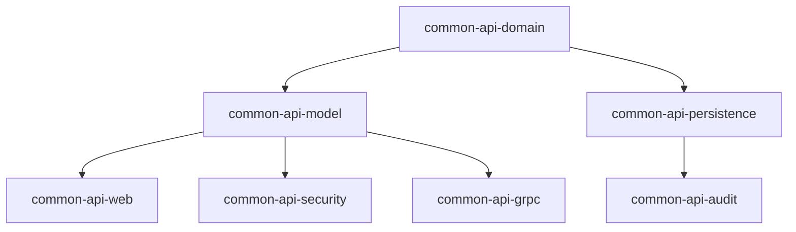

# common-api-domain

[](LICENSE)
[](https://kotlinlang.org/)
[](https://openjdk.org/)

> **The foundational domain primitives layer for the Blugrid Codex ecosystem**

This module defines **Blugrid's canonical domain primitives** for use across all Kotlin-based modules and code generation targets. It provides strongly typed value classes to enforce correctness and consistency for commonly used concepts like identifiers and timestamps.

---

## 🎯 **Purpose in the Common API Framework**

### **Core Layer Position**
`common-api-domain` sits at the **bottom of the dependency graph** as the foundational layer:



### **Design Philosophy**
- **Framework-agnostic**: Zero dependencies on Micronaut, Spring, or any infrastructure
- **Pure domain modeling**: Contains only business concepts and validation rules
- **Type safety**: Leverages Kotlin's inline value classes for zero-cost abstractions
- **Immutability**: All domain primitives are immutable by design
- **Domain-driven**: Follows DDD principles with ubiquitous language

---

## 📁 **Directory Structure**

```
common-api-domain/
├── build.gradle.kts              # Minimal build configuration
├── gradle.properties             # Version declarations
├── README.md                     # This file
└── src/
    └── main/
        └── kotlin/
            └── net/
                └── blugrid/
                    └── common/
                        └── domain/
                            ├── IdentityID.kt           # Long-based identity
                            ├── IdentityUUID.kt         # UUID-based identity  
                            ├── CreatedTimestamp.kt     # Creation time
                            ├── LastChangedTimestamp.kt # Modification time
                            └── EffectiveTimestamp.kt   # Activation time
```

---

## 📦 **Provided Domain Types**

### **Identity Types**

| Type | Description | Use Case | Example |
|------|-------------|----------|---------|
| `IdentityID` | Long-based sequential identity | Internal database keys | `IdentityID(12345L)` |
| `IdentityUUID` | UUID-based globally unique identity | External references, distributed systems | `IdentityUUID(UUID.randomUUID())` |

### **Temporal Types**

| Type | Description | Mutability | Example |
|------|-------------|------------|---------|
| `CreatedTimestamp` | Resource creation time | Read-only | `CreatedTimestamp(Instant.now())` |
| `LastChangedTimestamp` | Last modification time | System-managed | `LastChangedTimestamp(Instant.now())` |
| `EffectiveTimestamp` | When resource becomes active | Business-controlled | `EffectiveTimestamp(Instant.parse("2024-01-01T00:00:00Z"))` |

---

## 🛠️ **Dependencies**

### **Runtime Dependencies**
```kotlin
api(libs.jakarta.validation)           // Validation annotations (future)
implementation(libs.bundles.kotlinCore) // Kotlin stdlib & reflect
```

### **Key Characteristics**
- **No framework dependencies**: Pure Kotlin/Java types only
- **Minimal footprint**: Only essential validation support (planned)
- **Zero runtime cost**: Inline value classes compile to primitives
- **Jackson serializable**: Automatic JSON serialization/deserialization
- **Validation ready**: Prepared for future validation constraints

---

## 🔗 **Usage Examples**

### **Basic Usage**
```kotlin
import net.blugrid.common.domain.*
import java.time.Instant
import java.util.UUID

// Identity types
val longId = IdentityID(42L)
val uuid = IdentityUUID(UUID.randomUUID())

// Timestamp types  
val created = CreatedTimestamp(Instant.now())
val effective = EffectiveTimestamp(Instant.parse("2024-01-01T00:00:00Z"))
val lastChanged = LastChangedTimestamp(Instant.now())

// Accessing wrapped values
println("ID: ${longId.value}")           // 42
println("UUID: ${uuid.value}")           // Random UUID
println("Created: ${created.value}")     // Current timestamp
```

### **Domain Entity Example**
```kotlin
data class Organisation(
    val id: IdentityID,
    val uuid: IdentityUUID,
    val name: String,
    val created: CreatedTimestamp,
    val lastChanged: LastChangedTimestamp,
    val effectiveFrom: EffectiveTimestamp
) {
    // Domain methods
    fun isActive(at: Instant = Instant.now()): Boolean {
        return !effectiveFrom.value.isAfter(at)
    }
    
    fun withUpdatedTimestamp(): Organisation {
        return copy(lastChanged = LastChangedTimestamp(Instant.now()))
    }
}
```

### **JPA Entity Integration (Hybrid Approach)**
```kotlin
// Domain model - uses value classes
data class Organisation(
    val id: IdentityID,
    val uuid: IdentityUUID,
    val name: String,
    val created: CreatedTimestamp,
    val effectiveFrom: EffectiveTimestamp
)

// JPA Entity - uses primitives for database mapping
@Entity
@Table(name = "organisations")
data class OrganisationEntity(
    @Id
    @GeneratedValue(strategy = GenerationType.IDENTITY)
    @Column(name = "id")
    val id: Long? = null,
    
    @Column(name = "uuid", unique = true, nullable = false)
    val uuid: UUID = UUID.randomUUID(),
    
    @Column(name = "name", nullable = false)
    val name: String,
    
    @Column(name = "created_timestamp", nullable = false)
    val created: Instant = Instant.now(),
    
    @Column(name = "effective_timestamp", nullable = false)
    val effectiveFrom: Instant
)

// Mapping extensions
fun Organisation.toEntity() = OrganisationEntity(
    id = this.id.value,
    uuid = this.uuid.value,
    name = this.name,
    created = this.created.value,
    effectiveFrom = this.effectiveFrom.value
)

fun OrganisationEntity.toDomain() = Organisation(
    id = IdentityID(this.id!!),
    uuid = IdentityUUID(this.uuid),
    name = this.name,
    created = CreatedTimestamp(this.created),
    effectiveFrom = EffectiveTimestamp(this.effectiveFrom)
)
```

### **JSON Serialization**
```kotlin
// DTOs use value classes for type safety
@Serializable
data class OrganisationCreateRequest(
    val name: String,
    val effectiveFrom: EffectiveTimestamp
)

@Serializable
data class OrganisationResponse(
    val id: IdentityID,
    val uuid: IdentityUUID,
    val name: String,
    val created: CreatedTimestamp,
    val effectiveFrom: EffectiveTimestamp
)

// Jackson automatically serializes inline value classes
// IdentityID(42) -> 42
// IdentityUUID(uuid) -> "550e8400-e29b-41d4-a716-446655440000"
// CreatedTimestamp(instant) -> "2024-01-01T12:00:00Z"
```

---

## 🚀 **Developer Guide**

### **Getting Started**

#### **Prerequisites**
- **JDK 17+** (OpenJDK recommended)
- **Gradle 8+**
- **Kotlin 1.9.23+**

#### **Adding as Dependency**
```kotlin
// In your build.gradle.kts
dependencies {
    api(project(":common:common-kotlin:common-api:common-api-domain"))
}
```

#### **Import Statements**
```kotlin
import net.blugrid.common.domain.IdentityID
import net.blugrid.common.domain.IdentityUUID
import net.blugrid.common.domain.CreatedTimestamp
import net.blugrid.common.domain.LastChangedTimestamp  
import net.blugrid.common.domain.EffectiveTimestamp
```

### **Coding Standards & Best Practices**

#### **✅ Do's**
- **Use appropriate identity types**: `IdentityID` for internal keys, `IdentityUUID` for external references
- **Immutable by default**: All domain primitives are immutable - follow this pattern
- **Meaningful naming**: Choose descriptive property names that express business intent
- **Validation at boundaries**: Validate inputs at service/controller boundaries, not in domain types
- **Zero-cost abstractions**: Leverage inline value classes for type safety without performance cost

#### **❌ Don'ts**
- **Don't add framework dependencies**: Keep this module pure
- **Don't expose mutable state**: Domain primitives should never be mutable
- **Don't mix identity types**: Be consistent - use `IdentityID` OR `IdentityUUID`, not both for the same entity
- **Don't bypass type safety**: Avoid casting or unwrapping values unnecessarily

#### **Code Style Example**
```kotlin
// ✅ Good - Type-safe, immutable, clear intent
data class Product(
    val id: IdentityID,
    val sku: String,
    val created: CreatedTimestamp,
    val lastModified: LastChangedTimestamp
) {
    fun markAsModified(): Product {
        return copy(lastModified = LastChangedTimestamp(Instant.now()))
    }
}

// ❌ Bad - Primitive obsession, mutable state
data class Product(
    var id: Long,
    var sku: String, 
    var created: Long,
    var lastModified: Long
) {
    fun markAsModified() {
        lastModified = System.currentTimeMillis() // Mutable!
    }
}
```

### **Testing Guidelines**

#### **Testing Strategy**
This module is currently **test-free by design** for the following reasons:
- **Simple wrappers**: Inline value classes have minimal logic to test
- **Compiler guarantees**: Kotlin compiler ensures value class behavior
- **Implicit testing**: Consuming modules will test these types in context
- **Future validation**: When validation is added, comprehensive tests will be included

Testing will be added when:
- Complex validation rules are implemented
- Business logic is added to domain types
- Serialization behavior needs verification

### **Performance Considerations**

#### **Inline Value Classes Benefits**
- **Zero boxing overhead**: Compiles directly to primitive types
- **Type safety**: Full compile-time type checking
- **Memory efficiency**: No wrapper object allocation
- **JVM optimization**: Enables better hotspot optimizations

#### **Benchmarking**
```kotlin
// Runtime performance is identical to primitives
val primitiveId: Long = 42L                    // Direct primitive
val wrappedId: IdentityID = IdentityID(42L)    // Zero-cost wrapper

// Both compile to the same bytecode!
```

---

## 🔧 **Building & Testing**

### **Local Development**

#### **Build the Module**
```bash
# From project root
./gradlew :common:common-kotlin:common-api:common-api-domain:build

# From module directory  
cd common/common-kotlin/common-api/common-api-domain
../../../../../gradlew build
```

#### **Run Tests**
```bash
# Currently no tests - module is test-free by design
# Tests will be added when validation logic is implemented

# To verify module builds correctly:
./gradlew :common:common-kotlin:common-api:common-api-domain:build
```

#### **Generate Documentation**
```bash
./gradlew :common:common-kotlin:common-api:common-api-domain:dokkaHtml
```

### **IDE Setup**

#### **IntelliJ IDEA**
1. Import as Gradle project
2. Set **Project SDK** to Java 17+
3. Enable **Kotlin** plugin
4. Configure **Code Style** to follow [Kotlin conventions](https://kotlinlang.org/docs/coding-conventions.html)

#### **Recommended Plugins**
- **Kotlin** (bundled)
- **Gradle** (bundled)
- **JUnit** (bundled)
- **SonarLint** (code quality)

### **Continuous Integration**

#### **GitHub Actions Example**
```yaml
name: common-api-domain CI

on:
  push:
    paths: ['common/common-kotlin/common-api/common-api-domain/**']
  pull_request:
    paths: ['common/common-kotlin/common-api/common-api-domain/**']

jobs:
  test:
    runs-on: ubuntu-latest
    steps:
      - uses: actions/checkout@v4
      - uses: actions/setup-java@v4
        with:
          java-version: '17'
          distribution: 'temurin'
      
      - name: Test domain module
        run: ./gradlew :common:common-kotlin:common-api:common-api-domain:test
      
      - name: Generate coverage
        run: ./gradlew :common:common-kotlin:common-api:common-api-domain:jacocoTestReport
        
      - name: Upload coverage  
        uses: codecov/codecov-action@v3
```

---

## 🔍 **Architecture Decisions**

### **Why Hybrid Domain/Persistence Approach?**
- **Type Safety in Domain**: Value classes prevent ID mixing and improve code clarity
- **JPA Compatibility**: Primitives work seamlessly with existing JPA tooling
- **Performance**: No JPA converter overhead or serialization complexity
- **Clear Boundaries**: Explicit mapping between domain and persistence layers
- **Migration Friendly**: Easy to adopt incrementally in existing codebases

### **Why Jackson Serialization?**
- **API Consistency**: DTOs use value classes, JSON uses primitives automatically
- **Zero Configuration**: Inline value classes serialize to wrapped values
- **Type Safety**: APIs get compile-time type checking without runtime cost
- **Future Validation**: Ready for validation annotations that bubble to HTTP responses

### **Why Separate Timestamp Types?**
- **Intent Expression**: `CreatedTimestamp` vs `EffectiveTimestamp` have different semantic meanings
- **Immutability Enforcement**: Some timestamps shouldn't be modified after creation
- **Validation Opportunities**: Different timestamp types can have different validation rules
- **API Clarity**: Method signatures become self-documenting

### **Why Framework Independence?**
- **Reusability**: Can be used in any Kotlin/Java application
- **Testing**: Easier to unit test without framework dependencies
- **Performance**: No dependency injection or reflection overhead
- **Evolution**: Framework changes don't affect core domain

---

## 🤝 **Contributing**

### **Making Changes**
1. **Create feature branch**: `git checkout -b feature/new-domain-type`
2. **Add your domain primitive**: Follow existing inline value class patterns
3. **Update documentation**: README and KDoc comments
4. **Verify build**: Ensure module compiles without warnings
5. **Test in consuming modules**: Verify integration with JPA entities and JSON serialization

### **Pull Request Checklist**
- [ ] New domain types follow inline value class pattern
- [ ] KDoc documentation for public APIs
- [ ] No framework dependencies introduced
- [ ] README updated with usage examples
- [ ] Build passes without warnings
- [ ] Jackson serialization works correctly
- [ ] JPA entity mapping examples provided

### **Code Review Guidelines**
- **Type Safety**: Are new types preventing common bugs?
- **Immutability**: Are all types immutable by design?
- **Performance**: Do inline value classes compile correctly?
- **Documentation**: Are usage examples clear and complete?

---

## 📚 **Related Documentation**

- [Common API Model](../common-api-model/README.md) - Data transfer objects
- [Common API Persistence](../common-api-persistence/README.md) - Database entities
- [Blugrid Codex Architecture](../../../../docs/architecture.md) - Overall system design
- [Code Generation Guide](../../../../docs/code-generation.md) - JDL usage patterns

---

## 📄 **License**

This project is licensed under the MIT License - see the [LICENSE](LICENSE) file for details.

---

## 🆘 **Support**

- **Issues**: [GitHub Issues](https://github.com/blugrid/blugrid-codex/issues)
- **Discussions**: [GitHub Discussions](https://github.com/blugrid/blugrid-codex/discussions)
- **Slack**: `#blugrid-codex` channel
- **Email**: `codex-support@blugrid.net`

---

*Built with ❤️ by the Blugrid Engineering Team*
