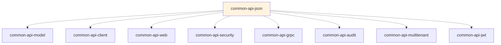

# common-api-json

[](LICENSE)
[](https://kotlinlang.org/)
[](https://openjdk.org/)
[](https://github.com/FasterXML/jackson)
[](https://github.com/nfeld/JSONPath-kt)

> **The comprehensive JSON processing foundation for the Blugrid Codex ecosystem**

This module provides **customized Jackson configuration, Kotlin-friendly JSON utilities, and JSONPath querying** used across all Blugrid APIs. It standardizes JSON serialization behavior, handles complex data type transformations, and enables powerful JSON manipulation and querying capabilities.

---

## 🎯 **Purpose in the Common API Framework**

### **Serialization Infrastructure**
`common-api-json` provides JSON processing services across **all application layers**:



### **Design Philosophy**
- **Customized Jackson**: Tailored ObjectMapper configuration for Blugrid's specific needs
- **Kotlin-optimized**: Extension functions and idioms for clean JSON handling
- **Type-safe**: Generic functions with reified types for compile-time safety
- **Performance-focused**: Optimized serialization settings for production workloads
- **JSONPath integration**: Powerful querying capabilities for complex JSON structures
- **Error-resilient**: Graceful handling of malformed JSON and type mismatches

---

## 📁 **Directory Structure**

```
common-api-json/
├── build.gradle.kts                       # Application build with JSON stack
├── gradle.properties                      # Version declarations
├── README.md                              # This file
└── src/
    ├── main/
    │   ├── kotlin/
    │   │   └── net/
    │   │       └── blugrid/
    │   │           └── api/
    │   │               └── json/
    │   │                   ├── Json.kt                     # Core JSON utilities
    │   │                   ├── JsonPath.kt                # JSONPath extensions
    │   │                   ├── config/
    │   │                   │   ├── CustomObjectMapperFactory.kt   # Jackson configuration
    │   │                   │   └── ObjectMapperBeanListener.kt    # Bean event handling (commented)
    │   │                   └── exception/
    │   │                       └── JsonException.kt       # JSON processing errors
    │   └── resources/
    │       ├── application-json.yml                       # Jackson configuration profile
    └── test/
        └── kotlin/
            └── net/
                └── blugrid/
                    └── api/
                        └── json/
                            └── DeserialisationTests.kt    # Serialization behavior tests
```

---

## 🛠️ **Dependencies**

### **Runtime Dependencies**
```kotlin
api(project(":common:common-kotlin:common-api:common-api-model"))
implementation(platform(libs.micronaut.bom))

// Core dependencies
implementation(libs.bundles.kotlinCore)
implementation(libs.bundles.micronautCore)
implementation(libs.bundles.jsonLibs)        // Complete JSON stack including JSONPath
implementation(libs.micronaut.serde)
implementation(libs.micronaut.validation)
```

### **Key Characteristics**
- **Jackson 2.17.2**: Latest stable Jackson with all modules
- **JSONPath support**: Advanced JSON querying and extraction
- **Kotlin integration**: Full Kotlin module support for data classes
- **Micronaut Serde**: Framework-integrated serialization
- **Custom configuration**: Blugrid-specific ObjectMapper settings

---

## 📚 **Core Components**

### **1. Custom ObjectMapper Configuration**

The `CustomObjectMapperFactory` provides enterprise-grade JSON handling:

```kotlin
@Singleton
@Replaces(ObjectMapperFactory::class)
open class CustomObjectMapperFactory : ObjectMapperFactory() {
    
    companion object {
        lateinit var objectMapper: ObjectMapper
        private const val LOCAL_DATE_TIME_FORMAT = "yyyy-MM-dd'T'HH:mm:ss.SSS"
    }
    
    override fun objectMapper(
        jacksonConfiguration: JacksonConfiguration?, 
        jsonFactory: JsonFactory?
    ): ObjectMapper {
        // Optimized factory with source location tracking
        val factory = JsonFactory.builder()
            .enable(StreamReadFeature.INCLUDE_SOURCE_IN_LOCATION)
            .build()
            
        objectMapper = super.objectMapper(jacksonConfiguration, factory)
        
        // Production-optimized serialization settings
        objectMapper.configure(SerializationFeature.WRITE_DATES_AS_TIMESTAMPS, false)
        objectMapper.configure(SerializationFeature.WRITE_ENUMS_USING_TO_STRING, true)
        objectMapper.configure(JsonGenerator.Feature.WRITE_BIGDECIMAL_AS_PLAIN, true)
        
        // Resilient deserialization
        objectMapper.configure(DeserializationFeature.FAIL_ON_UNKNOWN_PROPERTIES, false)
        objectMapper.configure(DeserializationFeature.ACCEPT_EMPTY_STRING_AS_NULL_OBJECT, true)
        objectMapper.configure(DeserializationFeature.ACCEPT_SINGLE_VALUE_AS_ARRAY, true)
        
        // Module registration
        objectMapper.registerModule(KotlinModule.Builder().build())
        objectMapper.registerModule(Jdk8Module())
        objectMapper.registerModule(customJavaTimeModule())
        objectMapper.registerModule(customSerializationModule())
        
        return objectMapper
    }
}
```

### **2. Kotlin JSON Extensions**

Clean, idiomatic JSON processing:

```kotlin
// Extension functions for natural Kotlin usage
inline fun <reified T : Any> String.fromJson() = objectMapper.readValue<T>(this)
inline fun <reified R : Any> R.toJson() = objectToJson(this)

// Type-safe deserialization
fun <T> readValue(json: String?, valueType: Class<T>?): T
fun <T> fromJson(json: String?, typeRef: TypeReference<T>?): T
fun <T> fromObject(obj: Any?, typeRef: TypeReference<T>?): T

// Collection handling
fun <T> deserializeListFromJson(json: String?, type: Class<T>?): List<T>
fun <T> deserializeFromObjectList(input: List<Any?>?, type: Class<T>?): List<T>

// Utility functions
fun objectToJson(obj: Any?): String
fun toPrettyJson(obj: Any?): String
fun toByteArray(obj: Any?): ByteArray
fun mapFromJson(json: String?): Map<String, Any>
```

### **3. JSONPath Integration**

Powerful JSON querying capabilities:

```kotlin
// JSONPath extensions for complex data extraction
inline fun <reified T : Any> String.readAs(path: String): T? =
    JsonPath.parse(this)?.read(path)

fun String.read(path: String): String? =
    JsonPath.parse(this)?.read(path)
```

### **4. Specialized Serializers**

Custom serialization for specific data types:

```kotlin
// Long to String serializer (prevents JavaScript precision issues)
class LongToStringSerializer : StdSerializer<Long>(Long::class.java) {
    override fun serialize(value: Long?, generator: JsonGenerator, provider: SerializerProvider) {
        value?.let {
            generator.writeString(it.toString())
        } ?: generator.writeNull()
    }
}

// Custom LocalDateTime handling
JavaTimeModule()
    .addSerializer(LocalDateTimeSerializer(DateTimeFormatter.ofPattern(LOCAL_DATE_TIME_FORMAT)))
    .addDeserializer(LocalDateTime::class.java, 
                    LocalDateTimeDeserializer(DateTimeFormatter.ofPattern(LOCAL_DATE_TIME_FORMAT)))
```

---

## 🔗 **Usage Examples**

### **Basic JSON Operations**

```kotlin
import net.blugrid.api.json.*

data class Customer(
    val id: IdentityID,
    val name: String,
    val email: String,
    val created: LocalDateTime
)

// Serialization
val customer = Customer(
    id = IdentityID(123L),
    name = "John Doe", 
    email = "john@example.com",
    created = LocalDateTime.now()
)

val json = customer.toJson()
// Output: {"id":"123","name":"John Doe","email":"john@example.com","created":"2024-07-09T14:30:15.123"}

// Deserialization  
val restored = json.fromJson<Customer>()
println(restored.name) // "John Doe"
```

### **Type-Safe Collection Handling**

```kotlin
// List serialization/deserialization
val customers = listOf(customer1, customer2, customer3)
val customersJson = customers.toJson()

val restoredCustomers = deserializeListFromJson(customersJson, Customer::class.java)

// Map handling
val customerMap = mapOf(
    "primary" to customer1,
    "secondary" to customer2
)

val mapJson = customerMap.toJson()
val restoredMap = mapFromJson(mapJson)
```

### **JSONPath Querying**

```kotlin
val complexJson = """
{
    "organisation": {
        "id": 123,
        "name": "Acme Corp",
        "departments": [
            {
                "name": "Engineering",
                "employees": [
                    {"name": "Alice", "role": "Senior Developer"},
                    {"name": "Bob", "role": "Tech Lead"}
                ]
            },
            {
                "name": "Marketing", 
                "employees": [
                    {"name": "Carol", "role": "Marketing Manager"}
                ]
            }
        ]
    }
}
""".trimIndent()

// Extract specific values
val orgName = complexJson.read("$.organisation.name") // "Acme Corp"
val employeeNames = complexJson.readAs<List<String>>("$.organisation.departments[*].employees[*].name")
// ["Alice", "Bob", "Carol"]

// Complex filtering
val techLeads = complexJson.readAs<List<String>>("$.organisation.departments[*].employees[?(@.role == 'Tech Lead')].name")
// ["Bob"]
```

### **Error Handling and Resilience**

```kotlin
// Graceful handling of malformed JSON
try {
    val result = malformedJson.fromJson<Customer>()
} catch (e: JsonException) {
    log.error("JSON parsing failed: ${e.message}")
    // Handle gracefully
}

// Nullable field handling
data class FlexibleCustomer(
    val id: IdentityID,
    val name: String,
    val email: String? = null,        // Optional field
    val phone: String? = null,        // Optional field
    val created: LocalDateTime = LocalDateTime.now()
)

// Handles missing fields gracefully
val partialJson = """{"id":"123","name":"John"}"""
val customer = partialJson.fromJson<FlexibleCustomer>() // Works fine
```

### **Custom Serialization Configuration**

```kotlin
// Using the global ObjectMapper for advanced scenarios
import net.blugrid.api.json.objectMapper

// Custom TypeReference for complex generics
val customerPageType = object : TypeReference<Page<Customer>>() {}
val customerPage = fromJson(pageJson, customerPageType)

// Node-based processing
val jsonNode = nodeFromJson(complexJson)
val processedNode = jsonNode.apply {
    // Modify JSON structure
    (this as ObjectNode).put("processed", true)
}

val modifiedJson = objectToJson(processedNode)
```

### **Production Optimizations**

```kotlin
// Efficient byte array handling for network operations
val customerBytes = toByteArray(customer)
// Send over network...

val receivedCustomer = fromJson(customerBytes, object : TypeReference<Customer>() {})

// Pretty printing for debugging (dev environments only)
if (log.isDebugEnabled) {
    log.debug("Customer object: {}", toPrettyJson(customer))
}

// Stream processing for large datasets
fun processLargeJsonStream(inputStream: InputStream) {
    val customerList = fromInputStream(inputStream, object : TypeReference<List<Customer>>() {})
    // Process efficiently...
}
```

### **Integration with Model Classes**

```kotlin
// Seamless integration with common-api-model abstractions
data class OrganisationResponse(
    override val id: IdentityID,
    override val uuid: IdentityUUID,
    val name: String,
    val description: String?,
    override val scope: TenantScope?,
    override val audit: ResourceAudit?
) : BaseTenantResource<OrganisationResponse> {
    override val resourceType = ResourceType.ORGANISATION
}

// JSON serialization respects all custom configurations
val org = OrganisationResponse(
    id = IdentityID(456L),
    uuid = IdentityUUID(UUID.randomUUID()),
    name = "Blugrid Technologies",
    description = "Technology solutions provider",
    scope = TenantScope(tenantId = IdentityID(1L)),
    audit = ResourceAudit(
        version = 1,
        created = AuditStamp(
            sessionId = IdentityID(789L),
            session = null,
            timestamp = LocalDateTime.now()
        )
    )
)

val json = org.toJson()
// Properly serializes all nested objects and custom types
```

---

## 🚀 **Developer Guide**

### **Getting Started**

#### **Prerequisites**
- **JDK 17+** (OpenJDK recommended)
- **Gradle 8+**
- **Kotlin 1.9.23+**
- **Jackson 2.17.2+**

#### **Adding as Dependency**
```kotlin
// In your build.gradle.kts
dependencies {
    implementation(project(":common:common-kotlin:common-api:common-api-json"))
}
```

#### **Import Statements**
```kotlin
// Core JSON utilities
import net.blugrid.api.json.*

// JSONPath querying
import net.blugrid.api.json.read
import net.blugrid.api.json.readAs

// Jackson types
import com.fasterxml.jackson.core.type.TypeReference
import com.fasterxml.jackson.databind.JsonNode
```

### **Configuration Profiles**

#### **Activating JSON Profile**
```bash
# Use custom JSON configuration
./gradlew run --args="--micronaut.environments=json"

# Combine with other profiles
./gradlew run --args="--micronaut.environments=test,json,debug"
```

#### **Custom Configuration** (`application-json.yml`)
```yaml
jackson:
  serialization:
    write-bigdecimal-as-plain: true
    write-date-timestamps-as-nanoseconds: false
    write-dates-as-timestamps: false
    write-enums-using-to-string: true
    write_numbers_as_strings: true

  deserialization:
    read-date-timestamps-as-nanoseconds: false
    read-enums-using-to-string: true
```

### **Coding Standards & Best Practices**

#### **✅ JSON Processing Patterns**
```kotlin
// ✅ Good - Use extension functions for clean syntax
val customer = customerJson.fromJson<Customer>()
val json = customer.toJson()

// ✅ Good - Type-safe generic functions
val customers: List<Customer> = deserializeListFromJson(json, Customer::class.java)

// ✅ Good - Explicit error handling
try {
    val result = untrustedJson.fromJson<Customer>()
} catch (e: JsonException) {
    log.warn("Invalid JSON received: {}", e.message)
    return defaultCustomer()
}

// ❌ Avoid - Direct ObjectMapper usage in business code
val mapper = ObjectMapper() // Should use global objectMapper
val customer = mapper.readValue(json, Customer::class.java) // Bypasses custom configuration
```

#### **✅ JSONPath Best Practices**
```kotlin
// ✅ Good - Safe JSONPath extraction with null handling
val productName = json.read("$.product.name") ?: "Unknown Product"
val prices = json.readAs<List<BigDecimal>>("$.product.prices[*]") ?: emptyList()

// ✅ Good - Complex JSONPath with appropriate type safety
val validOrders = json.readAs<List<Map<String, Any>>>(
    "$.orders[?(@.status == 'confirmed' && @.total > 100)]"
) ?: emptyList()

// ❌ Avoid - Unchecked JSONPath results
val productName = json.read("$.product.name")!! // Can throw NPE
```

#### **✅ Performance Optimizations**
```kotlin
// ✅ Good - Reuse TypeReference objects
companion object {
    private val CUSTOMER_LIST_TYPE = object : TypeReference<List<Customer>>() {}
}

fun processCustomers(json: String): List<Customer> {
    return fromJson(json, CUSTOMER_LIST_TYPE)
}

// ✅ Good - Efficient byte array processing
fun serializeForNetwork(data: Any): ByteArray = toByteArray(data)

// ✅ Good - Conditional pretty printing
fun debugJson(obj: Any) {
    if (log.isDebugEnabled) {
        log.debug("Object state: {}", toPrettyJson(obj))
    }
}

// ❌ Avoid - Unnecessary pretty printing in production
val json = toPrettyJson(largeObject) // Expensive formatting
log.info("Processing: {}", json) // INFO level always enabled
```

### **Testing Strategy**

The module includes targeted tests for serialization behavior:

```kotlin
@MicronautTest
class SerdeTests {
    
    @Test
    fun `Test Sales Entry`(objectMapper: ObjectMapper) {
        // Tests that required fields throw appropriate exceptions
        assertThrows<MismatchedInputException> { 
            objectMapper.readValue("{\"qty\":2}", testSalesReportPeriod::class.java) 
        }
    }
    
    @Test
    fun `Test Sales Optional Entry`(objectMapper: ObjectMapper) {
        // Tests that optional fields handle missing values gracefully
        val result = objectMapper.readValue("{\"qty\":2}", testSalesOptionalReportPeriod::class.java)
        assertNotNull(result)
        assertNull(result.reportPeriodId)
    }
}
```

### **Performance Considerations**

#### **ObjectMapper Optimization**
```kotlin
// Global ObjectMapper is pre-configured and shared
// Avoid creating new ObjectMapper instances
val sharedMapper = objectMapper // ✅ Use global instance

// Custom configurations are applied once at startup
// No runtime configuration overhead
```

#### **Memory Efficiency**
```kotlin
// Efficient handling of large JSON structures
fun processLargeJson(inputStream: InputStream): List<Customer> {
    // Streams directly without loading entire JSON into memory
    return fromInputStream(inputStream, object : TypeReference<List<Customer>>() {})
}

// Lazy JSONPath evaluation
val lazyExtraction = json.readAs<List<String>>("$.complex.path[*].field")
// Only evaluates when accessed
```

---

## 🔧 **Building & Testing**

### **Local Development**

#### **Build the Module**
```bash
# From project root
./gradlew :common:common-kotlin:common-api:common-api-json:build

# From module directory
cd common/common-kotlin/common-api/common-api-json
../../../../../gradlew build
```

#### **Run Tests**
```bash
# Execute serialization tests
./gradlew :common:common-kotlin:common-api:common-api-json:test

# Test with different profiles
./gradlew test --args="--micronaut.environments=json"
```

#### **Generate Documentation**
```bash
./gradlew :common:common-kotlin:common-api:common-api-json:dokkaHtml
```

### **IDE Setup**

#### **IntelliJ IDEA Configuration**
1. Import as Gradle project
2. Enable **Kotlin** and **Jackson** plugins
3. Configure **JSON Schema** validation
4. Set up **Live Templates** for common patterns:
   ```kotlin
   val $VAR$ = $JSON$.fromJson<$TYPE$>()
   val json = $OBJECT$.toJson()
   ```

#### **JSON Formatting Configuration**
```json
{
    "editor.formatOnSave": true,
    "editor.codeActionsOnSave": {
        "source.fixAll": true
    },
    "[json]": {
        "editor.defaultFormatter": "esbenp.prettier-vscode"
    }
}
```

---

## 🔍 **Architecture Decisions**

### **Why Custom ObjectMapper Factory?**
- **Standardization**: Consistent JSON behavior across all services
- **Performance**: Optimized settings for production workloads
- **Type Safety**: Kotlin-specific modules and configurations
- **Long Serialization**: Prevents JavaScript precision issues with large numbers

### **Why JSONPath Integration?**
- **Complex Queries**: Extract data from nested JSON without deserialization
- **API Flexibility**: Enable client-side data filtering and projection
- **Performance**: Selective data extraction without full object materialization
- **Integration**: Works seamlessly with external APIs and webhooks

### **Why Extension Functions?**
- **Kotlin Idioms**: Natural syntax that feels native to Kotlin
- **Type Safety**: Reified generics provide compile-time type checking
- **Convenience**: Reduces boilerplate and improves readability
- **Consistency**: Uniform JSON handling patterns across all modules

### **Why Global ObjectMapper?**
- **Performance**: Single instance avoids repeated configuration overhead
- **Consistency**: All JSON processing uses the same settings
- **Memory Efficiency**: Shared instance reduces memory footprint
- **Configuration**: Centralized place for all Jackson customizations

---

## 🤝 **Contributing**

### **Making Changes**
1. **Create feature branch**: `git checkout -b feature/json-enhancement`
2. **Follow existing patterns**: Use extension functions and type-safe operations
3. **Add comprehensive tests**: Cover serialization edge cases
4. **Update documentation**: README and configuration examples
5. **Verify performance**: Ensure changes don't impact JSON processing speed

### **Pull Request Checklist**
- [ ] Extension functions follow established patterns
- [ ] Tests cover serialization/deserialization behavior
- [ ] No breaking changes to existing JSON format
- [ ] Performance impact assessed and documented
- [ ] KDoc documentation for public APIs
- [ ] README updated with usage examples
- [ ] Build passes without warnings

### **Code Review Guidelines**
- **Performance Impact**: Do changes affect JSON processing speed?
- **Type Safety**: Are new functions properly type-safe?
- **Error Handling**: Is error handling consistent and appropriate?
- **Documentation**: Are examples clear and complete?
- **Backward Compatibility**: Do changes maintain existing JSON contracts?

---

## 📚 **Related Documentation**

- [Common API Model](../common-api-model/README.md) - DTOs and resource abstractions
- [Common API Client](../common-api-client/README.md) - HTTP client JSON handling
- [Common API Web](../common-api-web/README.md) - Web layer JSON processing
- [Common API JWT](../common-api-jwt/README.md) - JWT token JSON handling
- [Jackson Documentation](https://github.com/FasterXML/jackson-docs) - Jackson reference
- [JSONPath Specification](https://goessner.net/articles/JsonPath/) - JSONPath syntax

---

## 📄 **License**

This project is licensed under the MIT License - see the [LICENSE](LICENSE) file for details.

---

## 🆘 **Support**

- **Issues**: [GitHub Issues](https://github.com/blugrid/blugrid-codex/issues)
- **Discussions**: [GitHub Discussions](https://github.com/blugrid/blugrid-codex/discussions)
- **Slack**: `#blugrid-codex` channel
- **Email**: `codex-support@blugrid.net`

---

*Built with ❤️ by the Blugrid Engineering Team*
