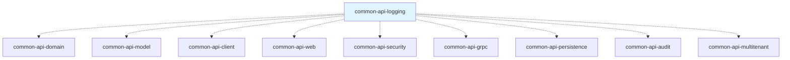

# common-api-logging

[](LICENSE)
[](https://kotlinlang.org/)
[](https://openjdk.org/)
[](https://micronaut.io/)
[](https://www.slf4j.org/)

> **The centralized logging foundation for the Blugrid Codex ecosystem**

This module provides **structured logging utilities, configuration profiles, and Kotlin-friendly logger extensions** used across all Blugrid APIs. It standardizes logging patterns, enables environment-specific log levels, and supports both development debugging and production monitoring.

---

## 🎯 **Purpose in the Common API Framework**

### **Cross-Cutting Infrastructure**
`common-api-logging` provides logging services across **all layers** of the architecture:



### **Design Philosophy**
- **Kotlin-optimized**: Extension functions for clean, idiomatic logging
- **Performance-aware**: Smart companion object unwrapping for optimal logger creation
- **Environment-ready**: Pre-configured profiles for development, testing, and production
- **Structured logging**: JSON support for production monitoring and analysis
- **Debug-friendly**: Comprehensive SQL and HTTP tracing for development

---

## 📁 **Directory Structure**

```
common-api-logging/
├── build.gradle.kts                    # Application-level build with logging stack
├── gradle.properties                   # Version declarations
├── README.md                           # This file
└── src/
    └── main/
        ├── kotlin/
        │   └── net/
        │       └── blugrid/
        │           └── api/
        │               └── logging/
        │                   └── Logger.kt           # Kotlin logger extensions
        └── resources/
            ├── application-logging.yml             # Base logging configuration
            ├── application-test-logging.yml        # Test environment profile
            └── application-debug-logging.yml       # Development debugging profile
```

---

## 🛠️ **Dependencies**

### **Runtime Dependencies**
```kotlin
api(project(":common:common-kotlin:common-api:common-api-model"))
implementation(platform(libs.micronaut.bom))

// Core dependencies
implementation(libs.bundles.kotlinCore)
implementation(libs.bundles.micronautCore)

// Logging stack
implementation(libs.logback.classic)         // Primary logging implementation (SLF4J)
implementation(libs.micronaut.jackson)       // For structured JSON logging
implementation(libs.jackson.kotlin)          // Kotlin support for JSON logging
```

### **Key Characteristics**
- **SLF4J-based**: Industry standard logging facade
- **Logback implementation**: High-performance, configurable logging engine
- **Jackson integration**: Structured JSON logging for production monitoring
- **Micronaut-ready**: Full framework integration and configuration support
- **Model dependencies**: Integrates with audit and resource tracking

---

## 📚 **Core Components**

### **1. Kotlin Logger Extensions**

The module provides idiomatic Kotlin extensions for clean logging:

```kotlin
// Smart logger creation with companion object unwrapping
inline fun <reified R : Any> R.logger() = logger(R::class.java)

fun logger(clazz: Class<*>) = LoggerFactory.getLogger(unwrapCompanionClass(clazz))

// Unwraps Kotlin companion objects to parent class for clean logger names
private fun <T : Any> unwrapCompanionClass(ofClass: Class<T>): Class<*> {
    return if (ofClass.enclosingClass != null && 
               ofClass.enclosingClass.kotlin.companionObject?.java == ofClass) {
        ofClass.enclosingClass  // Use parent class name instead of "Companion"
    } else {
        ofClass
    }
}
```

### **2. Environment-Specific Configurations**

#### **Base Configuration** (`application-logging.yml`)
```yaml
logger:
  levels:
    net.blugrid.api: DEBUG
```

#### **Test Environment** (`application-test-logging.yml`)
```yaml
logger:
  levels:
    net.blugrid.api: DEBUG
    org.hibernate.SQL: DEBUG
    org.hibernate.orm.jdbc.extract: TRACE
    org.hibernate.orm.jdbc.bind: TRACE
```

#### **Debug Environment** (`application-debug-logging.yml`)
```yaml
logger:
  levels:
    net.blugrid.api: DEBUG
    org.hibernate.SQL: DEBUG
    org.hibernate.orm.jdbc.extract: TRACE
    org.hibernate.orm.jdbc.bind: TRACE
    org.hibernate.engine.transaction.internal.TransactionImpl: DEBUG
    io.micronaut.http.client: TRACE
    io.micronaut.discovery: INFO
    io.micronaut.http.server: TRACE
    io.micronaut.json: INFO
    io.micronaut.security: DEBUG
```

---

## 🔗 **Usage Examples**

### **Basic Logger Usage**

```kotlin
import net.blugrid.api.logging.logger

@Controller("/api/organisations")
class OrganisationController(
    private val service: OrganisationService
) {
    // Extension function creates logger with clean class name
    private val log = logger()
    
    @Get("/{id}")
    fun getById(@PathVariable id: Long): OrganisationResponse {
        log.info("Fetching organisation with ID: {}", id)
        
        return try {
            val organisation = service.findById(id)
            log.debug("Successfully retrieved organisation: {}", organisation.name)
            organisation
        } catch (e: NotFoundException) {
            log.warn("Organisation not found: {}", id)
            throw e
        } catch (e: Exception) {
            log.error("Error fetching organisation: {}", id, e)
            throw APIInternalServerException("Failed to retrieve organisation")
        }
    }
}
```

### **Service Layer Logging**

```kotlin
@Singleton
class OrganisationService(
    private val repository: OrganisationRepository,
    private val auditService: AuditService
) {
    private val log = logger()
    
    @Transactional
    fun create(request: OrganisationCreate): OrganisationResponse {
        log.info("Creating new organisation: {}", request.name)
        
        // Validate business rules
        validateOrganisation(request)
        
        // Create entity
        val entity = request.toEntity()
        val saved = repository.save(entity)
        
        log.debug("Saved organisation entity with ID: {}", saved.id)
        
        // Audit tracking
        auditService.logCreation(saved)
        
        val response = saved.toDomain()
        log.info("Successfully created organisation: {} with ID: {}", 
                response.name, response.id)
        
        return response
    }
    
    private fun validateOrganisation(request: OrganisationCreate) {
        log.debug("Validating organisation: {}", request.name)
        
        if (repository.existsByName(request.name)) {
            log.warn("Organisation already exists with name: {}", request.name)
            throw ValidationException("Organisation name already exists")
        }
        
        log.debug("Organisation validation passed: {}", request.name)
    }
}
```

### **Companion Object Logger Pattern**

```kotlin
// The logger extension automatically unwraps companion objects
class ProductService {
    companion object {
        // This creates a logger with name "ProductService", not "ProductService$Companion"
        private val log = logger()
    }
    
    fun processProduct(product: Product) {
        log.info("Processing product: {}", product.name)
        // Smart unwrapping ensures clean logger names in output
    }
}

// Alternative instance-based approach
class CustomerService {
    private val log = logger()  // Logger name: "CustomerService"
    
    fun processCustomer(customer: Customer) {
        log.info("Processing customer: {}", customer.email)
    }
}
```

### **Repository Logging with SQL Tracing**

```kotlin
@Repository
interface OrganisationRepository : CrudRepository<OrganisationEntity, Long> {
    
    @Query("SELECT o FROM OrganisationEntity o WHERE o.name LIKE :namePattern")
    fun findByNamePattern(@Param("namePattern") namePattern: String): List<OrganisationEntity>
}

@Singleton
class OrganisationRepositoryImpl(
    private val repository: OrganisationRepository
) {
    private val log = logger()
    
    fun searchByName(searchTerm: String): List<OrganisationEntity> {
        val pattern = "%$searchTerm%"
        log.debug("Searching organisations with pattern: {}", pattern)
        
        val results = repository.findByNamePattern(pattern)
        log.debug("Found {} organisations matching pattern: {}", results.size, pattern)
        
        // With debug profile, SQL queries and parameters are automatically logged:
        // DEBUG org.hibernate.SQL - select o1_0.id, o1_0.name from organisations o1_0 where o1_0.name like ?
        // TRACE org.hibernate.orm.jdbc.bind - binding parameter [1] as [VARCHAR] - [%acme%]
        
        return results
    }
}
```

### **Multi-Tenant Logging Context**

```kotlin
@Singleton
class TenantAwareService(
    private val contextProvider: RequestContextProvider
) {
    private val log = logger()
    
    fun processRequest() {
        val tenantId = contextProvider.currentTenantId
        val sessionId = contextProvider.currentSessionId
        
        // Include tenant context in all log messages
        log.info("Processing request for tenant: {}, session: {}", tenantId, sessionId)
        
        try {
            // Business logic
            performBusinessOperation()
            
            log.info("Successfully processed request for tenant: {}", tenantId)
        } catch (e: Exception) {
            log.error("Failed to process request for tenant: {}, session: {}", 
                     tenantId, sessionId, e)
            throw e
        }
    }
}
```

### **Audit Event Logging**

```kotlin
@EventListener
class AuditLoggingHandler {
    private val log = logger()
    
    fun handleAuditEvent(event: AuditEvent) {
        when (event.auditEventType) {
            AuditEventType.CREATE -> {
                log.info("Resource created - Type: {}, ID: {}, Tenant: {}, Session: {}", 
                        event.resourceType, 
                        event.resourceId, 
                        event.tenantId, 
                        event.sessionId)
            }
            AuditEventType.UPDATE -> {
                log.info("Resource updated - Type: {}, ID: {}, Version: {}, Session: {}", 
                        event.resourceType, 
                        event.resourceId, 
                        event.version, 
                        event.sessionId)
            }
            AuditEventType.DELETE -> {
                log.warn("Resource deleted - Type: {}, ID: {}, Session: {}", 
                        event.resourceType, 
                        event.resourceId, 
                        event.sessionId)
            }
        }
    }
}
```

---

## 🚀 **Developer Guide**

### **Getting Started**

#### **Prerequisites**
- **JDK 17+** (OpenJDK recommended)
- **Gradle 8+**
- **Kotlin 1.9.23+**
- **Micronaut 4.4.3+**

#### **Adding as Dependency**
```kotlin
// In your build.gradle.kts
dependencies {
    implementation(project(":common:common-kotlin:common-api:common-api-logging"))
}
```

#### **Import Statements**
```kotlin
import net.blugrid.api.logging.logger
import org.slf4j.Logger
import org.slf4j.LoggerFactory
```

### **Configuration Profiles**

#### **Activating Logging Profiles**
```bash
# Base logging (production-like)
./gradlew run

# Test environment with SQL logging
./gradlew run --args="--micronaut.environments=test"

# Debug environment with full tracing
./gradlew run --args="--micronaut.environments=debug"

# Multiple profiles
./gradlew run --args="--micronaut.environments=test,debug"
```

#### **Custom Profile Configuration**
```yaml
# application-production.yml
logger:
  levels:
    root: WARN
    net.blugrid.api: INFO
    io.micronaut: WARN
    
# Structured JSON logging for production
logback:
  appenders:
    - type: console
      encoder:
        type: json
        includeContext: true
        includeMdc: true
```

### **Coding Standards & Best Practices**

#### **✅ Logger Creation Patterns**
```kotlin
// ✅ Good - Extension function with automatic unwrapping
class CustomerService {
    private val log = logger()  // Clean logger name: "CustomerService"
    
    fun processCustomer(customer: Customer) {
        log.info("Processing customer: {}", customer.email)
    }
}

// ✅ Good - Companion object pattern
class ProductService {
    companion object {
        private val log = logger()  // Name: "ProductService" (not "Companion")
    }
}

// ❌ Avoid - Manual logger creation
class OrderService {
    private val log = LoggerFactory.getLogger(OrderService::class.java)  // Verbose
}

// ❌ Avoid - String-based logger names
class PaymentService {
    private val log = LoggerFactory.getLogger("PaymentService")  // Error-prone
}
```

#### **✅ Log Message Patterns**
```kotlin
// ✅ Good - Parameterized messages (SLF4J style)
log.info("User {} created order {} with {} items", userId, orderId, itemCount)
log.error("Failed to process payment for order: {}", orderId, exception)

// ✅ Good - Structured context information
log.info("Request processed - Tenant: {}, User: {}, Duration: {}ms", 
         tenantId, userId, processingTime)

// ✅ Good - Appropriate log levels
log.trace("Entering method processOrder with parameters: {}", parameters)
log.debug("Database query returned {} results", resultCount)
log.info("Order {} successfully created for customer {}", orderId, customerId)
log.warn("Retrying failed operation: attempt {} of {}", attempt, maxAttempts)
log.error("Critical system error in payment processing", exception)

// ❌ Avoid - String concatenation
log.info("User " + userId + " created order " + orderId)  // Inefficient

// ❌ Avoid - Log level misuse
log.error("User {} logged in successfully", userId)  // Should be INFO
log.debug("System crashed with error: {}", exception)  // Should be ERROR
```

#### **✅ Exception Logging**
```kotlin
// ✅ Good - Include exception with context
try {
    processPayment(payment)
} catch (e: PaymentProcessingException) {
    log.error("Payment processing failed for order: {}, amount: {}", 
              payment.orderId, payment.amount, e)
    throw e
} catch (e: Exception) {
    log.error("Unexpected error processing payment: {}", payment.orderId, e)
    throw APIInternalServerException("Payment processing failed")
}

// ✅ Good - Different handling for different exception types
catch (e: ValidationException) {
    log.warn("Validation error for order: {} - {}", orderId, e.message)
    throw e
} catch (e: NotFoundException) {
    log.info("Order not found: {}", orderId)  // Not an error, might be expected
    throw e
}

// ❌ Avoid - Logging and re-throwing without adding value
try {
    service.doSomething()
} catch (e: Exception) {
    log.error("Error occurred", e)  // No context
    throw e  // Same exception, no additional information
}
```

### **Performance Considerations**

#### **Lazy Evaluation for Debug Logs**
```kotlin
// ✅ Good - Parameterized messages (automatically lazy)
log.debug("Complex calculation result: {}", expensiveCalculation())  // Only called if DEBUG enabled

// ✅ Good - Explicit lazy evaluation for complex scenarios
if (log.isDebugEnabled) {
    log.debug("Detailed object state: {}", createDetailedReport(object))
}

// ❌ Avoid - Eager evaluation
log.debug("Result: " + expensiveOperation())  // Always executed, even if debug disabled
```

#### **MDC (Mapped Diagnostic Context) Usage**
```kotlin
import org.slf4j.MDC

class RequestProcessor {
    private val log = logger()
    
    fun processRequest(request: RequestContext) {
        // Add context to all log messages in this thread
        MDC.put("requestId", request.id)
        MDC.put("tenantId", request.tenantId.toString())
        MDC.put("userId", request.userId.toString())
        
        try {
            log.info("Processing request")  // Includes MDC context
            // Business logic
            log.info("Request completed successfully")
        } finally {
            MDC.clear()  // Clean up thread-local storage
        }
    }
}
```

### **Testing Strategy**

This module is currently **test-free by design**:
- **Simple utilities**: Logger creation extensions are straightforward
- **Configuration files**: YAML files are validated by framework
- **Integration testing**: Logging behavior is verified in consuming modules

Testing will be added when:
- Custom log formatters are implemented
- Complex logging logic is added
- Structured logging transformations are required

---

## 🔧 **Building & Testing**

### **Local Development**

#### **Build the Module**
```bash
# From project root
./gradlew :common:common-kotlin:common-api:common-api-logging:build

# From module directory
cd common/common-kotlin/common-api/common-api-logging
../../../../../gradlew build
```

#### **Verify Configuration**
```bash
# Test different logging profiles
./gradlew run --args="--micronaut.environments=debug"

# Check log output formatting
./gradlew run --args="--micronaut.environments=test" 2>&1 | grep "org.hibernate.SQL"
```

#### **Generate Documentation**
```bash
./gradlew :common:common-kotlin:common-api:common-api-logging:dokkaHtml
```

### **IDE Setup**

#### **IntelliJ IDEA Configuration**
1. Import as Gradle project
2. Enable **Kotlin** and **Micronaut** plugins
3. Configure **Log Highlighting** plugin for log file viewing
4. Set up **Live Templates** for common logging patterns:
   ```kotlin
   private val log = logger()
   log.info("$MESSAGE$: {}", $PARAM$)
   ```

#### **Logging Output Configuration**
```xml
<!-- Add to IntelliJ run configuration VM options -->
-Dlogback.configurationFile=src/main/resources/logback-dev.xml
-Dmicronaut.environments=debug
```

---

## 🔍 **Architecture Decisions**

### **Why SLF4J + Logback?**
- **Industry Standard**: SLF4J is the de facto logging facade for JVM applications
- **Performance**: Logback provides excellent performance and configurability
- **Flexibility**: Easy to switch implementations without code changes
- **Structured Logging**: Built-in JSON support for production monitoring

### **Why Kotlin Extensions?**
- **Idiomatic Code**: Extensions feel natural in Kotlin codebases
- **Companion Object Handling**: Automatic unwrapping for clean logger names
- **Type Safety**: Compile-time logger creation without string literals
- **Consistency**: Uniform logging patterns across all modules

### **Why Environment Profiles?**
- **Development Productivity**: Debug profile shows SQL queries and HTTP traces
- **Testing Clarity**: Test profile focuses on application and database logs
- **Production Efficiency**: Base profile minimizes noise and maximizes performance
- **Operational Monitoring**: JSON structured logging for production analysis

### **Why Cross-Cutting Dependencies?**
- **Audit Integration**: Logging works with audit events and resource tracking
- **Multi-Tenant Context**: Automatic tenant and session information in logs
- **Error Correlation**: Consistent error logging across all API layers
- **Monitoring Integration**: Structured logs enable better alerting and dashboards

---

## 🤝 **Contributing**

### **Making Changes**
1. **Create feature branch**: `git checkout -b feature/logging-enhancement`
2. **Follow existing patterns**: Use extension functions and YAML configuration
3. **Test multiple profiles**: Verify logging works across environments
4. **Update documentation**: README and configuration examples
5. **Verify build**: Ensure module compiles and integrates correctly

### **Pull Request Checklist**
- [ ] Logger extensions follow established patterns
- [ ] Configuration files are valid YAML
- [ ] No breaking changes to existing log levels
- [ ] KDoc documentation for public APIs
- [ ] README updated with usage examples
- [ ] Build passes without warnings
- [ ] Integration tested with consuming modules

### **Code Review Guidelines**
- **Performance Impact**: Do changes affect logging performance?
- **Configuration Clarity**: Are log levels appropriate for environments?
- **Extension Design**: Do new extensions follow Kotlin idioms?
- **Documentation**: Are examples clear and complete?
- **Backward Compatibility**: Do changes maintain existing behavior?

---

## 📚 **Related Documentation**

- [Common API Model](../common-api-model/README.md) - Resource abstractions and audit events
- [Common API Security](../common-api-security/README.md) - Authentication context logging
- [Common API Audit](../common-api-audit/README.md) - Audit event tracking
- [Common API Multitenant](../common-api-multitenant/README.md) - Tenant context logging
- [Blugrid Codex Architecture](../../../../docs/architecture.md) - Overall system design
- [Monitoring Guide](../../../../docs/monitoring.md) - Production logging and alerting

---

## 📄 **License**

This project is licensed under the MIT License - see the [LICENSE](LICENSE) file for details.

---

## 🆘 **Support**

- **Issues**: [GitHub Issues](https://github.com/blugrid/blugrid-codex/issues)
- **Discussions**: [GitHub Discussions](https://github.com/blugrid/blugrid-codex/discussions)
- **Slack**: `#blugrid-codex` channel
- **Email**: `codex-support@blugrid.net`

---

*Built with ❤️ by the Blugrid Engineering Team*
