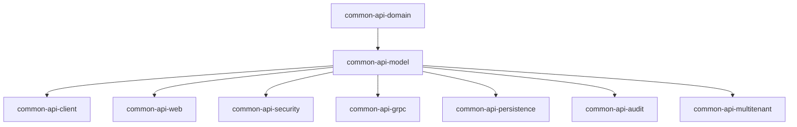

# common-api-model

[](LICENSE)
[](https://kotlinlang.org/)
[](https://openjdk.org/)
[](https://micronaut.io/)

> **The comprehensive data modeling layer for the Blugrid Codex ecosystem**

This module provides **DTOs, resource abstractions, controller interfaces, and utility classes** used across all Kotlin-based APIs. It serves as the foundation for REST APIs, pagination, error handling, and multi-tenant data modeling throughout the Blugrid platform.

---

## 🎯 **Purpose in the Common API Framework**

### **Application Layer Position**
`common-api-model` sits in the **application layer** providing shared contracts and utilities:



### **Design Philosophy**
- **Contract-driven**: Defines consistent DTOs and interfaces across all APIs
- **Swagger-first**: Full OpenAPI documentation with examples
- **Multi-tenant ready**: Built-in support for tenant and business unit scoping
- **Audit-aware**: Comprehensive audit tracking for all resources
- **Error-safe**: Structured exception handling with detailed error responses
- **Pagination-optimized**: Advanced querying and sorting capabilities

---

## 📁 **Directory Structure**

```
common-api-model/
├── build.gradle.kts                 # Full application build with web stack
├── gradle.properties               # Version declarations
├── README.md                       # This file
└── src/
    └── main/
        └── kotlin/
            └── net/
                └── blugrid/
                    └── api/
                        ├── common/
                        │   ├── model/
                        │   │   ├── audit/               # Audit tracking
                        │   │   │   ├── AuditEvent.kt
                        │   │   │   ├── AuditEventLog.kt
                        │   │   │   ├── AuditEventType.kt
                        │   │   │   ├── AuditStamp.kt
                        │   │   │   └── ResourceAudit.kt
                        │   │   ├── resource/            # Resource abstractions
                        │   │   │   ├── BaseResource.kt
                        │   │   │   ├── BaseAuditedResource.kt
                        │   │   │   ├── BaseCreateResource.kt
                        │   │   │   ├── BaseUpdateResource.kt
                        │   │   │   ├── BaseTenantResource.kt
                        │   │   │   ├── BaseBusinessUnitResource.kt
                        │   │   │   ├── UnscopedResource.kt
                        │   │   │   ├── ResourceType.kt
                        │   │   │   └── Searchable.kt
                        │   │   ├── scope/               # Multi-tenancy scoping
                        │   │   │   ├── TenantScope.kt
                        │   │   │   └── BusinessUnitScope.kt
                        │   │   ├── query/               # Pagination & querying
                        │   │   │   ├── PageableQuery.kt
                        │   │   │   ├── SortableQuery.kt
                        │   │   │   ├── SortField.kt
                        │   │   │   ├── DefaultPageRequest.kt
                        │   │   │   └── PageMapping.kt
                        │   │   ├── search/              # Search abstractions
                        │   │   │   ├── SearchPage.kt
                        │   │   │   └── SearchIndex.kt
                        │   │   └── exception/           # Error handling
                        │   │       ├── APIError.kt
                        │   │       ├── APIException.kt
                        │   │       ├── NotFoundException.kt
                        │   │       ├── APIAccessDeniedException.kt
                        │   │       └── APIInternalServerException.kt
                        │   └── controller/              # Controller interfaces
                        │       ├── GenericQueryResource.kt
                        │       └── GenericCommandResource.kt
                        ├── security/                    # Security models
                        │   ├── model/
                        │   │   ├── BaseAuthenticatedSession.kt
                        │   │   ├── BaseAuthenticatedUser.kt
                        │   │   ├── BaseAuthenticatedOrganisation.kt
                        │   │   ├── DecoratedAuthentication.kt
                        │   │   ├── AuthenticationType.kt
                        │   │   ├── AuthenticatedUser.kt
                        │   │   └── AuthenticatedOrganisation.kt
                        │   └── context/
                        │       ├── RequestContextProvider.kt
                        │       ├── SessionContext.kt
                        │       ├── GuestSessionContext.kt
                        │       ├── WebApplicationSessionContext.kt
                        │       ├── BusinessUnitSessionContext.kt
                        │       ├── OperatorRef.kt
                        │       └── WebApplicationRef.kt
                        ├── session/                     # Session management
                        │   └── model/
                        │       ├── SessionType.kt
                        │       ├── GuestSession.kt
                        │       ├── TenantSession.kt
                        │       └── BusinessUnitSession.kt
                        ├── userIdentity/               # User abstractions
                        │   └── model/
                        │       └── UserIdentity.kt
                        ├── organisation/               # Organisation abstractions
                        │   └── model/
                        │       └── Organisation.kt
                        └── util/                       # Utility classes
                            ├── Either.kt
                            ├── SwaggerConstants.kt
                            ├── CommonExtensions.kt
                            └── EntityExtensions.kt
```

---

## 🛠️ **Dependencies**

### **Runtime Dependencies**
```kotlin
api(project(":common:common-kotlin:common-api:common-api-domain"))
implementation(platform(libs.micronaut.bom))
implementation(platform(libs.aws.bom))

// Core stack
implementation(libs.bundles.kotlinCore)
implementation(libs.bundles.micronautCore)
implementation(libs.bundles.micronautWeb)

// Data & serialization
implementation(libs.micronaut.data.model)
implementation(libs.micronaut.serde)
implementation(libs.micronaut.validation)
implementation(libs.jackson.kotlin)
implementation(libs.mapstruct)
implementation(libs.kotlin.builder.annotation)
```

### **Key Characteristics**
- **Full application stack**: Includes Micronaut web framework
- **Domain integration**: Built on common-api-domain primitives
- **Jackson serialization**: Full JSON support for DTOs
- **OpenAPI ready**: Swagger annotations throughout
- **MapStruct mapping**: Object transformation utilities
- **Builder pattern**: Kotlin builder support for DTOs

---

## 📦 **Core Components**

### **1. Resource Abstractions**

The module provides a comprehensive hierarchy of resource abstractions:

| Interface/Class | Purpose | Key Features |
|----------------|---------|--------------|
| `BaseResource<T>` | Core resource contract | ID, UUID, basic structure |
| `BaseAuditedResource<T>` | Auditable resources | Version, creation/modification tracking |
| `BaseTenantResource<T>` | Tenant-scoped resources | Multi-tenancy support |
| `BaseBusinessUnitResource<T>` | Business unit resources | Organizational hierarchy |
| `UnscopedResource<T>` | Global resources | No tenant restrictions |
| `BaseCreateResource<T>` | Create request DTOs | UUID-based creation |
| `BaseUpdateResource<T>` | Update request DTOs | ID + UUID updates |

### **2. Multi-Tenant Scoping**

```kotlin
// Tenant-level scoping
@Schema(description = "Tenant-scoped organisation")
data class OrganisationResponse(
    override val id: IdentityID,
    override val uuid: IdentityUUID,
    val name: String,
    override val scope: TenantScope?,
    override val audit: ResourceAudit?
) : BaseTenantResource<OrganisationResponse> {
    override val resourceType = ResourceType.ORGANISATION
}

// Business unit scoping  
@Schema(description = "Business unit-scoped project")
data class ProjectResponse(
    override val id: IdentityID,
    override val uuid: IdentityUUID,
    val title: String,
    override val scope: BusinessUnitScope?,
    override val audit: ResourceAudit?
) : BaseBusinessUnitResource<ProjectResponse> {
    override val resourceType = ResourceType.PROJECT
}
```

### **3. Advanced Pagination & Querying**

```kotlin
// Pageable queries with sorting
@Schema(description = "Query organisations with pagination")
data class OrganisationQuery(
    val name: String?,
    val status: String?
)

// Usage in controllers
@Post("/query")
fun queryOrganisations(
    @Body query: PageableQuery<OrganisationQuery>
): Page<OrganisationResponse> {
    val pageable = query.toPageable()
    return organisationService.findAll(query.query, pageable)
}

// Advanced sorting
val sortedQuery = PageableQuery(
    query = OrganisationQuery(name = "Acme"),
    sort = listOf(
        SortField("name", Sort.Order.Direction.ASC),
        SortField("created", Sort.Order.Direction.DESC)
    )
)
```

### **4. Comprehensive Error Handling**

```kotlin
// Structured API errors
throw NotFoundException(
    message = "Organisation not found",
    details = listOf(
        APIErrorDetail(
            field = "id",
            message = "Organisation with ID 123 does not exist"
        )
    )
)

// Validation errors with field-level details
throw APIException(
    apiError = DefaultAPIError(
        statusCode = "400",
        code = "VALIDATION_ERROR",
        message = "Invalid organisation data",
        details = listOf(
            APIErrorValidationDetail(
                field = "name",
                value = "",
                message = "Name cannot be empty"
            )
        )
    )
)
```

### **5. Audit Event System**

```kotlin
// Audit events for tracking changes
@EventListener
fun handleOrganisationUpdate(event: AuditEvent) {
    when (event.auditEventType) {
        AuditEventType.CREATE -> logCreation(event)
        AuditEventType.UPDATE -> logUpdate(event)
        AuditEventType.DELETE -> logDeletion(event)
    }
}

// Automatic audit stamping
data class ResourceAudit(
    val version: Int = 0,
    val created: AuditStamp? = null,
    val lastChanged: AuditStamp? = null
)
```

### **6. Generic Controller Interfaces**

```kotlin
// Query operations
interface GenericQueryResource<F, T> {
    fun query(@Body query: PageableQuery<F>): Page<T>
    fun getAll(): List<T>
    fun getPage(pageable: Pageable): Page<T>
    fun getById(@PathVariable id: Long): T
    fun getByUuid(@PathVariable uuid: UUID): T
}

// Command operations
interface GenericCommandResource<T, U, V> {
    fun create(@Body created: U): T
    fun update(@PathVariable id: Long, @Body updated: V): T
    fun delete(@PathVariable id: Long)
}

// Implementation example
@Controller("/api/organisations")
class OrganisationController(
    private val service: OrganisationService
) : GenericQueryResource<OrganisationQuery, OrganisationResponse>,
    GenericCommandResource<OrganisationResponse, OrganisationCreate, OrganisationUpdate>
```

---

## 🔗 **Usage Examples**

### **Creating a Domain-Specific Resource**

```kotlin
// 1. Define the response DTO
@Schema(description = "Product information")
data class ProductResponse(
    override val id: IdentityID,
    override val uuid: IdentityUUID,
    
    @Schema(description = "Product name", example = "Premium Widget")
    val name: String,
    
    @Schema(description = "Product SKU", example = "PWD-001")
    val sku: String,
    
    @Schema(description = "Product price", example = "29.99")
    val price: BigDecimal,
    
    override val scope: TenantScope?,
    override val audit: ResourceAudit?
) : BaseTenantResource<ProductResponse>, Searchable {
    override val resourceType = ResourceType.PRODUCT
    override val searchTerms = listOf(name, sku).toSearchTerms()
}

// 2. Define create/update DTOs
@Schema(description = "Create new product")
data class ProductCreate(
    override var uuid: IdentityUUID = IdentityUUID(UUID.randomUUID()),
    
    @Schema(description = "Product name", example = "Premium Widget")
    val name: String,
    
    @Schema(description = "Product SKU", example = "PWD-001") 
    val sku: String,
    
    @Schema(description = "Product price", example = "29.99")
    val price: BigDecimal
) : BaseCreateResource<ProductCreate>

@Schema(description = "Update existing product")
data class ProductUpdate(
    override var id: IdentityID,
    override var uuid: IdentityUUID,
    
    @Schema(description = "Product name", example = "Premium Widget Pro")
    val name: String?,
    
    @Schema(description = "Product price", example = "39.99")
    val price: BigDecimal?
) : BaseUpdateResource<ProductUpdate>

// 3. Define query filters
@Schema(description = "Product search criteria")
data class ProductQuery(
    @Schema(description = "Filter by name", example = "Widget")
    val name: String?,
    
    @Schema(description = "Filter by SKU", example = "PWD")
    val sku: String?,
    
    @Schema(description = "Minimum price", example = "10.00")
    val minPrice: BigDecimal?,
    
    @Schema(description = "Maximum price", example = "100.00")
    val maxPrice: BigDecimal?
)
```

### **Implementing Security Context**

```kotlin
// Custom authentication for business unit access
data class ProductionAuthentication(
    override val authenticationType: AuthenticationType = AuthenticationType.BUSINESS_UNIT,
    override val providerId: String,
    override val principalName: String,
    override val principalEmail: String,
    override val sessionId: String,
    override val userId: String,
    override val expirationTime: Date?,
    override val user: BaseAuthenticatedUser,
    override val session: BusinessUnitSession
) : DecoratedAuthentication<BusinessUnitSession>

// Request context usage
@Injectable
class ProductService(
    private val contextProvider: RequestContextProvider
) {
    fun findByTenant(): List<ProductResponse> {
        val tenantId = contextProvider.currentTenantId
            ?: throw APIAccessDeniedException("Tenant context required")
        
        return productRepository.findByTenantId(tenantId)
    }
    
    fun findByBusinessUnit(): List<ProductResponse> {
        val businessUnitId = contextProvider.currentBusinessUnitId
            ?: throw APIAccessDeniedException("Business unit context required")
            
        return productRepository.findByBusinessUnitId(businessUnitId)
    }
}
```

### **Advanced Search Implementation**

```kotlin
// Search index for full-text search
data class ProductSearchIndex(
    override val resourceId: Long,
    override val resourceType: ResourceType = ResourceType.PRODUCT,
    override val resource: ProductResponse,
    override val tenantId: Long,
    override val searchTerms: String,
    override val createdTimestamp: LocalDateTime?,
    override val lastChangedTimestamp: LocalDateTime?
) : SearchIndex<ProductResponse>

// Search page results
@Controller("/api/products")
class ProductSearchController(
    private val searchService: ProductSearchService
) {
    @Post("/search")
    fun search(
        @Body query: PageableQuery<String>
    ): SearchPage<ProductResponse, ProductSearchMetadata> {
        return searchService.searchProducts(
            searchTerm = query.query,
            pageable = query.toPageable()
        )
    }
}
```

---

## 🚀 **Developer Guide**

### **Getting Started**

#### **Prerequisites**
- **JDK 17+** (OpenJDK recommended)
- **Gradle 8+**
- **Kotlin 1.9.23+**
- **Micronaut 4.4.3+**

#### **Adding as Dependency**
```kotlin
// In your build.gradle.kts
dependencies {
    api(project(":common:common-kotlin:common-api:common-api-model"))
}
```

#### **Import Statements**
```kotlin
// Resource abstractions
import net.blugrid.api.common.model.resource.*
import net.blugrid.api.common.model.audit.*
import net.blugrid.api.common.model.scope.*

// Query utilities
import net.blugrid.api.common.model.query.*
import net.blugrid.api.common.model.search.*

// Exception handling
import net.blugrid.api.common.exception.*

// Controller interfaces
import net.blugrid.api.common.controller.*

// Security models
import net.blugrid.api.security.model.*
import net.blugrid.api.security.context.*
```

### **Coding Standards & Best Practices**

#### **✅ Resource Design Patterns**
```kotlin
// ✅ Good - Clear hierarchy, proper typing
@Schema(description = "Customer information")
data class CustomerResponse(
    override val id: IdentityID,
    override val uuid: IdentityUUID,
    val name: String,
    val email: String,
    override val scope: TenantScope?,
    override val audit: ResourceAudit?
) : BaseTenantResource<CustomerResponse> {
    override val resourceType = ResourceType.CUSTOMER
}

// ❌ Bad - No base class, primitive IDs
data class CustomerResponse(
    val id: Long,              // Should use IdentityID
    val uuid: String,          // Should use IdentityUUID  
    val name: String,
    val email: String
    // Missing audit and scope information
)
```

#### **✅ Error Handling Patterns**
```kotlin
// ✅ Good - Structured error with details
fun validateCustomer(customer: CustomerCreate) {
    val errors = mutableListOf<APIErrorDetail>()
    
    if (customer.name.isBlank()) {
        errors.add(APIErrorDetail(
            field = "name",
            message = "Customer name is required"
        ))
    }
    
    if (customer.email.isBlank()) {
        errors.add(APIErrorDetail(
            field = "email", 
            message = "Email address is required"
        ))
    }
    
    if (errors.isNotEmpty()) {
        throw APIException(
            apiError = DefaultAPIError(
                statusCode = "400",
                code = "VALIDATION_ERROR",
                message = "Customer validation failed",
                details = errors
            )
        )
    }
}

// ❌ Bad - Generic exception without details
fun validateCustomer(customer: CustomerCreate) {
    if (customer.name.isBlank()) {
        throw RuntimeException("Invalid customer") // No structure
    }
}
```

#### **✅ Pagination Best Practices**
```kotlin
// ✅ Good - Structured query with defaults
@Controller("/api/customers") 
class CustomerController {
    @Post("/query")
    fun queryCustomers(
        @Body query: PageableQuery<CustomerQuery>
    ): Page<CustomerResponse> {
        // Validate page size limits
        val safePageable = query.toPageable().let { pageable ->
            if (pageable.size > 100) {
                DefaultPageRequest(pageable.number, 100, pageable.sort)
            } else pageable
        }
        
        return customerService.findAll(query.query, safePageable)
    }
}

// ❌ Bad - No size limits, unclear interface
@Controller("/api/customers")
class CustomerController {
    @Get
    fun getCustomers(
        @QueryValue page: Int?,
        @QueryValue size: Int?,
        @QueryValue sort: String?
    ): List<CustomerResponse> { // Should return Page<T>
        // No validation or structure
        return customerService.findAll()
    }
}
```

### **Testing Strategy**

This module is currently **test-free by design** following the same principles as common-api-domain:
- **Interface contracts**: Behavior is tested in implementing modules
- **DTO structures**: Simple data classes with minimal logic
- **Framework integration**: Tested in integration scenarios

Testing will be added when:
- Complex validation logic is implemented
- Custom serialization behavior is added
- Business rules are embedded in models

### **Performance Considerations**

#### **JSON Serialization Optimization**
```kotlin
// Leverage Jackson's built-in optimizations
@JsonInclude(JsonInclude.Include.NON_NULL)
data class CustomerResponse(
    val id: IdentityID,
    val uuid: IdentityUUID,
    val name: String,
    val email: String?,        // Nullable fields excluded when null
    val phone: String?
) : BaseTenantResource<CustomerResponse>

// Use @JsonIgnore for computed properties
data class ProductResponse(
    val id: IdentityID,
    val name: String,
    val price: BigDecimal,
    
    @JsonIgnore
    val computedTotal: BigDecimal get() = price * quantity
) : BaseTenantResource<ProductResponse>
```

#### **Pagination Performance**
```kotlin
// Efficient database queries with proper indexing
data class CustomerQuery(
    @Schema(description = "Filter by status - indexed field")
    val status: CustomerStatus?,
    
    @Schema(description = "Filter by creation date - indexed field") 
    val createdAfter: LocalDateTime?,
    
    @Schema(description = "Full-text search - use with caution")
    val searchTerm: String?
)
```

---

## 🔧 **Building & Testing**

### **Local Development**

#### **Build the Module**
```bash
# From project root
./gradlew :common:common-kotlin:common-api:common-api-model:build

# From module directory
cd common/common-kotlin/common-api/common-api-model
../../../../../gradlew build
```

#### **Verify Build**
```bash
# Currently no tests - module is test-free by design
# To verify module builds correctly:
./gradlew :common:common-kotlin:common-api:common-api-model:build

# Check code style
./gradlew :common:common-kotlin:common-api:common-api-model:ktlintCheck
```

#### **Generate Documentation**
```bash
./gradlew :common:common-kotlin:common-api:common-api-model:dokkaHtml
```

### **IDE Setup**

#### **IntelliJ IDEA Configuration**
1. Import as Gradle project
2. Set **Project SDK** to Java 17+
3. Enable **Kotlin** and **Micronaut** plugins
4. Configure **OpenAPI** plugin for Swagger support
5. Set up **Jackson** formatting for JSON

#### **Recommended Plugins**
- **Kotlin** (bundled)
- **Micronaut** (framework support)
- **OpenAPI Specification** (Swagger editing)
- **Jackson** (JSON formatting)
- **SonarLint** (code quality)

---

## 🔍 **Architecture Decisions**

### **Why Comprehensive Base Classes?**
- **Consistency**: All resources follow the same patterns
- **Multi-tenancy**: Built-in support for organizational scoping
- **Audit trails**: Automatic tracking of changes and access
- **API documentation**: Self-documenting through Swagger annotations

### **Why Generic Controller Interfaces?**
- **Code generation**: JDL templates can implement these contracts
- **Consistency**: All APIs have the same operation signatures
- **Testing**: Easier to write integration tests against known interfaces
- **Documentation**: Standard OpenAPI patterns across all endpoints

### **Why Structured Error Handling?**
- **Client-friendly**: Detailed error information for debugging
- **Internationalization**: Error codes can be localized
- **API consistency**: All errors follow the same format
- **Monitoring**: Structured errors easier to aggregate and alert on

### **Why Advanced Pagination?**
- **Performance**: Large datasets require efficient pagination
- **User experience**: Complex sorting and filtering capabilities
- **API flexibility**: Same query interface works for different backends
- **Caching**: Deterministic query parameters enable better caching

---

## 🤝 **Contributing**

### **Making Changes**
1. **Create feature branch**: `git checkout -b feature/new-resource-type`
2. **Follow resource patterns**: Use existing base classes and interfaces
3. **Add Swagger documentation**: Complete @Schema annotations
4. **Update documentation**: README and KDoc comments
5. **Verify build**: Ensure module compiles without warnings
6. **Test integration**: Verify with consuming modules

### **Pull Request Checklist**
- [ ] New resources extend appropriate base classes
- [ ] Complete Swagger/OpenAPI documentation
- [ ] Follow established naming conventions
- [ ] KDoc documentation for public APIs
- [ ] No breaking changes to existing interfaces
- [ ] README updated with usage examples
- [ ] Build passes without warnings

### **Code Review Guidelines**
- **Resource design**: Do new types follow established patterns?
- **Multi-tenancy**: Are scoping rules correctly implemented?
- **Error handling**: Are errors properly structured and documented?
- **Documentation**: Are examples clear and complete?
- **Backward compatibility**: Do changes maintain API contracts?

---

## 📚 **Related Documentation**

- [Common API Domain](../common-api-domain/README.md) - Domain primitives and value classes
- [Common API Security](../common-api-security/README.md) - Authentication and authorization
- [Common API Web](../common-api-web/README.md) - HTTP utilities and controllers
- [Common API Persistence](../common-api-persistence/README.md) - Database entities and repositories
- [Blugrid Codex Architecture](../../../../docs/architecture.md) - Overall system design
- [Code Generation Guide](../../../../docs/code-generation.md) - JDL usage patterns

---

## 📄 **License**

This project is licensed under the MIT License - see the [LICENSE](LICENSE) file for details.

---

## 🆘 **Support**

- **Issues**: [GitHub Issues](https://github.com/blugrid/blugrid-codex/issues)
- **Discussions**: [GitHub Discussions](https://github.com/blugrid/blugrid-codex/discussions)
- **Slack**: `#blugrid-codex` channel
- **Email**: `codex-support@blugrid.net`

---

*Built with ❤️ by the Blugrid Engineering Team*
