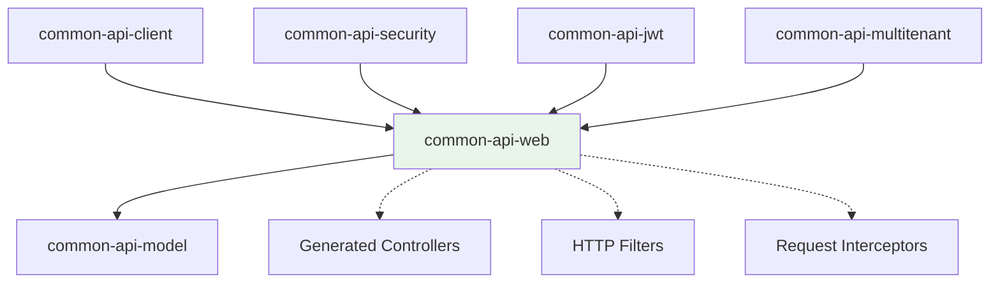

# common-api-web

[](LICENSE)
[](https://kotlinlang.org/)
[](https://openjdk.org/)
[](https://micronaut.io/)
[](https://netty.io/)

> **The HTTP utilities and web layer foundation for the Blugrid Codex ecosystem**

This module provides **HTTP utilities, cookie management, JWT helpers, and web layer abstractions** used across all Blugrid web applications. It standardizes HTTP request/response handling, provides secure cookie management, and offers convenient utilities for common web operations.

---

## 🎯 **Purpose in the Common API Framework**

### **Web Layer Infrastructure**
`common-api-web` provides HTTP utilities that support **controllers and web operations**:



### **Design Philosophy**
- **HTTP-focused**: Specialized utilities for web request/response handling
- **Security-aware**: Secure cookie management with HttpOnly and path settings
- **JWT-integrated**: Helper functions for JWT token cookie handling
- **Extension-based**: Kotlin extensions for clean, fluent HTTP operations
- **Production-ready**: Proper security defaults and error handling

---

## 📁 **Directory Structure**

```
common-api-web/
├── build.gradle.kts                       # Web stack build configuration
├── gradle.properties                      # Version declarations
├── README.md                              # This file
└── src/
    └── main/
        └── kotlin/
            └── net/
                └── blugrid/
                    └── api/
                        └── jwt/
                            └── JwtUtils.kt             # JWT/HTTP utilities
```

---

## 🛠️ **Dependencies**

### **Runtime Dependencies**
```kotlin
api(project(":common:common-kotlin:common-api:common-api-model"))
implementation(platform(libs.micronaut.bom))

// Core dependencies
implementation(libs.bundles.kotlinCore)
implementation(libs.bundles.micronautCore)
implementation(libs.bundles.micronautWeb)      // Complete web stack including Netty
implementation(libs.micronaut.data.model)      // For pagination utilities
implementation(libs.bundles.micronautSecurity) // For auth-related HTTP utilities
```

### **Key Characteristics**
- **Full web stack**: Complete Micronaut web framework with Netty
- **Security integration**: Built-in authentication and authorization support
- **Data model support**: Pagination utilities for web responses
- **Production-ready**: Enterprise-grade HTTP server capabilities

---

## 📚 **Core Components**

### **1. HTTP Request Extensions**

Utilities for enhancing HTTP requests with cookies:

```kotlin
// Apply multiple cookies to a request
fun <T> MutableHttpRequest<T>.applyCookies(cookies: List<Cookie>): MutableHttpRequest<T> {
    return apply {
        cookies.forEach { this.cookie(it) }
    }
}
```

### **2. Cookie Management Utilities**

Comprehensive cookie handling with security defaults:

```kotlin
// Convert Netty cookies to Micronaut cookies
fun DefaultCookie.toCookie() = let { defaultCookie ->
    val cookie = Cookie.of(defaultCookie.name(), defaultCookie.value())
    cookie.domain(defaultCookie.domain())
    cookie.path(defaultCookie.path())
    cookie.httpOnly(defaultCookie.isHttpOnly)
    cookie.secure(defaultCookie.isSecure)
    cookie.maxAge(defaultCookie.maxAge())
    cookie
}

// Create secure cookies from strings
fun String.toCookie(cookieName: String, ttl: Long): Cookie = this.let { value ->
    return DefaultCookie(cookieName, value)
        .apply {
            isHttpOnly = true    // Security: Prevent XSS access
            setMaxAge(ttl)
            setPath("/")         // Available across entire application
        }
        .toCookie()
}
```

### **3. HTTP Response Extensions**

Fluent cookie management for responses:

```kotlin
// Clear multiple cookies from response
fun MutableHttpResponse<*>.clearCookies(cookies: List<String>): MutableHttpResponse<*> {
    cookies.forEach { clearCookie(it) }
    return this
}

// Clear individual cookie
fun MutableHttpResponse<*>.clearCookie(cookieName: String) {
    cookie(
        Cookie.of(cookieName, "")
            .maxAge(0)           // Immediate expiration
            .path("/")
    )
}

// Set secure cookie with proper encoding
fun MutableHttpResponse<*>.setCookie(
    cookieName: String, 
    cookieValue: String, 
    maxAge: Long = 300000L
): MutableHttpResponse<*> {
    val cookie = DefaultCookie(cookieName, cookieValue).apply {
        isHttpOnly = true
        setMaxAge(maxAge)
        setPath("/")
    }
    val cookieHeader = ServerCookieEncoder.LAX.encode(cookie)
    headers.add("set-cookie", cookieHeader)
    return this
}

// Apply multiple cookies to response
fun MutableHttpResponse<*>.applyCookies(cookies: List<DefaultCookie>): MutableHttpResponse<*> {
    cookies.forEach { cookie ->
        val cookieHeader = ServerCookieEncoder.LAX.encode(cookie)
        this.headers.add("set-cookie", cookieHeader)
    }
    return this
}
```

---

## 🔗 **Usage Examples**

### **Cookie-Based Authentication**

```kotlin
import net.blugrid.api.jwt.*

@Controller("/api/auth")
class AuthenticationController {
    
    @Post("/login")
    fun login(
        @Body loginRequest: LoginRequest,
        response: MutableHttpResponse<LoginResponse>
    ): LoginResponse {
        // Authenticate user
        val authResult = authService.authenticate(loginRequest)
        
        if (authResult.isSuccess) {
            // Set secure authentication cookie
            response.setCookie(
                cookieName = "auth_token",
                cookieValue = authResult.jwtToken,
                maxAge = TimeUnit.HOURS.toSeconds(24) // 24 hours
            )
            
            // Set refresh token cookie
            response.setCookie(
                cookieName = "refresh_token", 
                cookieValue = authResult.refreshToken,
                maxAge = TimeUnit.DAYS.toSeconds(30) // 30 days
            )
            
            return LoginResponse(
                success = true,
                user = authResult.user,
                expiresAt = authResult.expiresAt
            )
        } else {
            throw AuthenticationException("Invalid credentials")
        }
    }
    
    @Post("/logout")
    fun logout(response: MutableHttpResponse<LogoutResponse>): LogoutResponse {
        // Clear authentication cookies
        response.clearCookies(listOf("auth_token", "refresh_token"))
        
        return LogoutResponse(success = true)
    }
}
```

### **JWT Token Cookie Management**

```kotlin
@Controller("/api/session")
class SessionController {
    
    @Get("/refresh")
    fun refreshSession(
        request: HttpRequest<*>,
        response: MutableHttpResponse<SessionResponse>
    ): SessionResponse {
        // Extract refresh token from cookie
        val refreshToken = request.cookies["refresh_token"]?.value
            ?: throw UnauthorizedException("No refresh token provided")
        
        // Validate and refresh the session
        val newSession = sessionService.refreshSession(refreshToken)
        
        // Create new JWT token cookie
        val jwtCookie = newSession.jwtToken.toCookie(
            cookieName = "auth_token",
            ttl = TimeUnit.HOURS.toSeconds(2) // Short-lived JWT
        )
        
        // Apply the new cookie
        response.cookie(jwtCookie)
        
        return SessionResponse(
            user = newSession.user,
            expiresAt = newSession.expiresAt
        )
    }
}
```

### **Multi-Tenant Cookie Handling**

```kotlin
@Controller("/api/tenant")
class TenantController {
    
    @Post("/switch/{tenantId}")
    fun switchTenant(
        @PathVariable tenantId: Long,
        request: HttpRequest<*>,
        response: MutableHttpResponse<TenantSwitchResponse>
    ): TenantSwitchResponse {
        // Validate user has access to tenant
        val userId = extractUserFromRequest(request)
        tenantService.validateAccess(userId, tenantId)
        
        // Create tenant context cookie
        val tenantCookie = tenantId.toString().toCookie(
            cookieName = "tenant_context",
            ttl = TimeUnit.HOURS.toSeconds(8) // 8 hour sessions
        )
        
        // Clear any existing tenant cookies and set new one
        response.clearCookie("tenant_context")
        response.cookie(tenantCookie)
        
        return TenantSwitchResponse(
            tenantId = tenantId,
            tenantName = tenantService.getTenantName(tenantId)
        )
    }
}
```

### **HTTP Client Cookie Forwarding**

```kotlin
@Client("/api/external")
interface ExternalApiClient {
    
    @Get("/data")
    fun fetchData(@Header authorization: String): ExternalDataResponse
}

@Injectable
class ExternalApiService(
    private val client: ExternalApiClient
) {
    
    fun fetchDataWithContext(request: HttpRequest<*>): ExternalDataResponse {
        // Extract auth token from incoming request
        val authToken = request.cookies["auth_token"]?.value
            ?: throw UnauthorizedException("Authentication required")
        
        // Forward authentication to external service
        return client.fetchData("Bearer $authToken")
    }
    
    fun createAuthenticatedRequest(
        baseRequest: HttpRequest<*>,
        targetUrl: String
    ): MutableHttpRequest<*> {
        // Create new request with forwarded cookies
        val authenticatedRequest = HttpRequest.GET<Any>(targetUrl)
        
        // Extract and forward relevant cookies
        val cookiesToForward = baseRequest.cookies.values.filter { cookie ->
            cookie.name in listOf("auth_token", "session_id", "tenant_context")
        }
        
        return authenticatedRequest.applyCookies(cookiesToForward)
    }
}
```

### **Secure Cookie Configuration**

```kotlin
@ConfigurationProperties("blugrid.cookies")
data class CookieConfiguration(
    val secure: Boolean = true,
    val httpOnly: Boolean = true,
    val sameSite: String = "Strict",
    val domain: String? = null,
    val authTokenTtl: Long = TimeUnit.HOURS.toSeconds(2),
    val refreshTokenTtl: Long = TimeUnit.DAYS.toSeconds(30),
    val sessionCookieName: String = "BGSESSION"
)

@Injectable
class SecureCookieService(
    private val config: CookieConfiguration
) {
    
    fun createSecureAuthCookie(token: String): Cookie {
        return token.toCookie(
            cookieName = config.sessionCookieName,
            ttl = config.authTokenTtl
        ).let { cookie ->
            if (config.secure) cookie.secure(true)
            if (config.domain != null) cookie.domain(config.domain)
            cookie
        }
    }
    
    fun createDefaultCookie(name: String, value: String, ttl: Long): DefaultCookie {
        return DefaultCookie(name, value).apply {
            isHttpOnly = config.httpOnly
            isSecure = config.secure
            setMaxAge(ttl)
            setPath("/")
            config.domain?.let { setDomain(it) }
        }
    }
    
    fun applySecurityHeaders(response: MutableHttpResponse<*>): MutableHttpResponse<*> {
        return response.apply {
            headers.add("X-Content-Type-Options", "nosniff")
            headers.add("X-Frame-Options", "DENY") 
            headers.add("X-XSS-Protection", "1; mode=block")
            headers.add("Strict-Transport-Security", "max-age=31536000; includeSubDomains")
        }
    }
}
```

### **HTTP Filter Integration**

```kotlin
@Filter("/api/**")
class AuthenticationFilter(
    private val jwtService: JwtService,
    private val contextProvider: RequestContextProvider
) : HttpServerFilter {
    
    override fun doFilter(
        request: HttpRequest<*>,
        chain: ServerFilterChain
    ): Publisher<MutableHttpResponse<*>> {
        
        // Extract JWT from cookie
        val jwtToken = request.cookies["auth_token"]?.value
        
        if (jwtToken != null && jwtService.isValid(jwtToken)) {
            // Valid token - proceed with request
            return chain.proceed(request)
        } else {
            // Invalid or missing token - return unauthorized
            return Mono.fromCallable {
                HttpResponse.unauthorized<Any>()
                    .apply {
                        // Clear invalid auth cookies
                        clearCookies(listOf("auth_token", "refresh_token"))
                    }
            }
        }
    }
}
```

---

## 🚀 **Developer Guide**

### **Getting Started**

#### **Prerequisites**
- **JDK 17+** (OpenJDK recommended)
- **Gradle 8+**
- **Kotlin 1.9.23+**
- **Micronaut 4.4.3+**

#### **Adding as Dependency**
```kotlin
// In your build.gradle.kts
dependencies {
    implementation(project(":common:common-kotlin:common-api:common-api-web"))
}
```

#### **Import Statements**
```kotlin
// JWT/Cookie utilities
import net.blugrid.api.jwt.*

// Micronaut HTTP
import io.micronaut.http.*
import io.micronaut.http.cookie.Cookie
import io.netty.handler.codec.http.cookie.DefaultCookie
```

### **Coding Standards & Best Practices**

#### **✅ Cookie Security Patterns**
```kotlin
// ✅ Good - Secure cookie with proper settings
fun createSecureCookie(name: String, value: String): Cookie {
    return value.toCookie(name, TimeUnit.HOURS.toSeconds(2)).apply {
        secure(true)     // HTTPS only
        httpOnly(true)   // Prevent XSS
        // SameSite handled by encoder
    }
}

// ✅ Good - Clear expired/invalid cookies
fun handleLogout(response: MutableHttpResponse<*>) {
    response.clearCookies(listOf(
        "auth_token",
        "refresh_token", 
        "session_id",
        "tenant_context"
    ))
}

// ❌ Avoid - Insecure cookie settings
fun createInsecureCookie(name: String, value: String): Cookie {
    return Cookie.of(name, value)  // No security settings
}
```

#### **✅ HTTP Response Patterns**
```kotlin
// ✅ Good - Fluent response building
fun buildAuthResponse(user: User, jwt: String): MutableHttpResponse<LoginResponse> {
    return HttpResponse.ok(LoginResponse(user))
        .setCookie("auth_token", jwt, TimeUnit.HOURS.toSeconds(2))
        .apply {
            headers.add("X-User-ID", user.id.toString())
        }
}

// ✅ Good - Consistent error responses
fun handleAuthError(): MutableHttpResponse<*> {
    return HttpResponse.unauthorized<Any>()
        .clearCookies(listOf("auth_token", "refresh_token"))
        .apply {
            headers.add("WWW-Authenticate", "Bearer")
        }
}

// ❌ Avoid - Inconsistent cookie management
fun buildInconsistentResponse(): MutableHttpResponse<*> {
    val response = HttpResponse.ok()
    response.cookie(Cookie.of("token", "value"))  // No TTL or security
    return response
}
```

#### **✅ Request Processing**
```kotlin
// ✅ Good - Safe cookie extraction with defaults
fun extractAuthToken(request: HttpRequest<*>): String? {
    return request.cookies["auth_token"]?.value
}

fun extractTenantId(request: HttpRequest<*>): Long? {
    return request.cookies["tenant_context"]?.value?.toLongOrNull()
}

// ✅ Good - Request enhancement for forwarding
fun forwardAuthentication(
    originalRequest: HttpRequest<*>,
    targetUrl: String
): MutableHttpRequest<*> {
    val relevantCookies = originalRequest.cookies.values.filter { cookie ->
        cookie.name in FORWARDED_COOKIE_NAMES
    }
    
    return HttpRequest.GET<Any>(targetUrl).applyCookies(relevantCookies)
}

// ❌ Avoid - Unchecked cookie access
fun unsafeTokenExtraction(request: HttpRequest<*>): String {
    return request.cookies["auth_token"]!!.value  // Can throw NPE
}
```

### **Security Considerations**

#### **Cookie Security Defaults**
```kotlin
// All cookies created through utilities have secure defaults:
// - HttpOnly: true (prevents XSS access)
// - Path: "/" (application-wide availability)
// - SameSite: LAX (CSRF protection)
// - Secure: should be true in production (HTTPS only)

// Production cookie configuration
object CookieDefaults {
    const val AUTH_COOKIE_NAME = "auth_token"
    const val REFRESH_COOKIE_NAME = "refresh_token"
    const val TENANT_COOKIE_NAME = "tenant_context"
    
    val AUTH_TTL = TimeUnit.HOURS.toSeconds(2)
    val REFRESH_TTL = TimeUnit.DAYS.toSeconds(30)
    val SESSION_TTL = TimeUnit.HOURS.toSeconds(8)
}
```

#### **CSRF Protection**
```kotlin
// SameSite cookies provide CSRF protection
// ServerCookieEncoder.LAX automatically sets SameSite=Lax
fun createCSRFProtectedCookie(name: String, value: String): DefaultCookie {
    return DefaultCookie(name, value).apply {
        isHttpOnly = true
        isSecure = true
        setPath("/")
        // SameSite=Lax set by encoder
    }
}
```

### **Testing Strategy**

This module is currently **test-free by design**:
- **HTTP utilities**: Simple extension functions with minimal logic
- **Cookie management**: Wrapper functions around standard HTTP APIs
- **Integration testing**: Web behavior tested in consuming modules

Testing will be added when:
- Complex request/response transformation logic is added
- Custom HTTP filters or interceptors are implemented
- Business rules are embedded in web utilities

---

## 🔧 **Building & Testing**

### **Local Development**

#### **Build the Module**
```bash
# From project root
./gradlew :common:common-kotlin:common-api:common-api-web:build

# From module directory
cd common/common-kotlin/common-api/common-api-web
../../../../../gradlew build
```

#### **Verify Integration**
```bash
# Test web stack integration
./gradlew :common:common-kotlin:common-api:common-api-web:assemble

# Verify Netty server startup
./gradlew run --args="--micronaut.environments=dev"
```

#### **Generate Documentation**
```bash
./gradlew :common:common-kotlin:common-api:common-api-web:dokkaHtml
```

### **IDE Setup**

#### **IntelliJ IDEA Configuration**
1. Import as Gradle project
2. Enable **Kotlin** and **Micronaut** plugins
3. Configure **HTTP Client** plugin for API testing
4. Set up **Live Templates** for common patterns:
   ```kotlin
   response.setCookie("$NAME$", $VALUE$, $TTL$)
   request.cookies["$NAME$"]?.value
   ```

#### **HTTP Testing Configuration**
```http
### Test Authentication
POST http://localhost:8080/api/auth/login
Content-Type: application/json

{
  "email": "user@example.com",
  "password": "password"
}

### Test with Cookie
GET http://localhost:8080/api/protected
Cookie: auth_token=jwt_token_here
```

---

## 🔍 **Architecture Decisions**

### **Why Extension Functions?**
- **Kotlin Idioms**: Extensions feel natural in Kotlin codebases
- **Fluent APIs**: Enable chaining for clean response building
- **Type Safety**: Compile-time checking of HTTP operations
- **Consistency**: Uniform patterns across all web interactions

### **Why Secure Cookie Defaults?**
- **Security First**: HttpOnly and Secure flags prevent common attacks
- **CSRF Protection**: SameSite cookies provide built-in CSRF protection
- **Production Ready**: No need to remember security settings
- **Compliance**: Meets modern web security standards

### **Why JWT Cookie Integration?**
- **Stateless Auth**: JWT tokens work well with REST APIs
- **XSS Protection**: HttpOnly cookies prevent token theft
- **Session Management**: Automatic cookie lifecycle management
- **Multi-tenant Support**: Separate cookies for different contexts

### **Why Netty Integration?**
- **Performance**: Netty provides high-performance HTTP server
- **Async Support**: Non-blocking I/O for better scalability
- **Cookie Encoding**: Proper cookie header encoding and parsing
- **Production Grade**: Battle-tested in enterprise environments

---

## 🤝 **Contributing**

### **Making Changes**
1. **Create feature branch**: `git checkout -b feature/web-enhancement`
2. **Follow extension patterns**: Use Kotlin extensions for fluent APIs
3. **Maintain security defaults**: Ensure all cookie utilities are secure
4. **Update documentation**: README and usage examples
5. **Verify integration**: Test with consuming modules

### **Pull Request Checklist**
- [ ] Extension functions follow established patterns
- [ ] Cookie utilities maintain security defaults
- [ ] No breaking changes to existing HTTP contracts
- [ ] KDoc documentation for public APIs
- [ ] README updated with usage examples
- [ ] Build passes without warnings
- [ ] Integration tested with auth flows

### **Code Review Guidelines**
- **Security**: Are cookie settings secure by default?
- **API Design**: Do extensions provide clean, fluent interfaces?
- **Performance**: Do utilities avoid unnecessary overhead?
- **Documentation**: Are examples clear and complete?
- **Compatibility**: Do changes work with existing web stack?

---

## 📚 **Related Documentation**

- [Common API Model](../common-api-model/README.md) - Controller interfaces and DTOs
- [Common API Security](../common-api-security/README.md) - Authentication and authorization
- [Common API JWT](../common-api-jwt/README.md) - JWT token handling
- [Common API Client](../common-api-client/README.md) - HTTP client utilities
- [Micronaut HTTP Documentation](https://docs.micronaut.io/latest/guide/#httpServer) - Framework reference
- [Netty Documentation](https://netty.io/wiki/) - Server implementation

---

## 📄 **License**

This project is licensed under the MIT License - see the [LICENSE](LICENSE) file for details.

---

## 🆘 **Support**

- **Issues**: [GitHub Issues](https://github.com/blugrid/blugrid-codex/issues)
- **Discussions**: [GitHub Discussions](https://github.com/blugrid/blugrid-codex/discussions)
- **Slack**: `#blugrid-codex` channel
- **Email**: `codex-support@blugrid.net`

---

*Built with ❤️ by the Blugrid Engineering Team*
