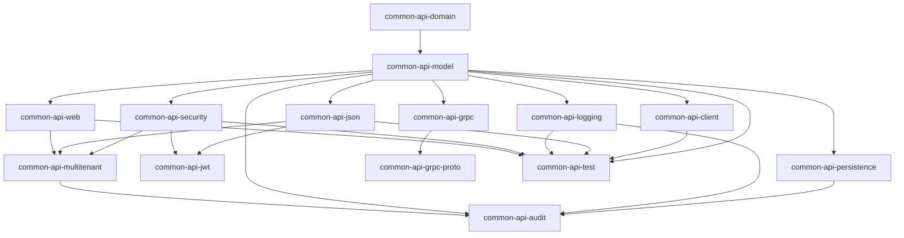

# Blugrid Codex: Library Versions & Common API Dependencies

## 📚 Library Versions (libs.versions.toml)

### Core Platform
| Component | Version | Description |
|-----------|---------|-------------|
| Kotlin | `1.9.23` | Primary language for backend development |
| Kotlin Plugin | `2.1.21` | Gradle plugin for Kotlin compilation |
| Micronaut | `4.4.3` | Core framework for microservices |
| Java | `17` | Target JVM version |

### Frameworks & Libraries
| Component | Version | Description |
|-----------|---------|-------------|
| gRPC | `1.62.2` | RPC framework for inter-service communication |
| Protobuf | `4.31.1` | Protocol buffers for serialization |
| Jackson | `2.17.2` | JSON serialization/deserialization |
| MapStruct | `1.5.3.Final` | Object mapping code generation |
| Nimbus JOSE JWT | `9.40` | JWT token handling |
| JUnit | `5.10.0` | Testing framework |
| Testcontainers | `1.19.0` | Integration testing with containers |

### Database & Persistence
| Component | Version | Description |
|-----------|---------|-------------|
| Hibernate | `6.4.1.Final` | ORM framework |
| Flyway | `10.22.0` | Database migration tool |
| Hypersistence Utils | `3.8.1` | Hibernate utilities |

### Build & Development Tools
| Component | Version | Description |
|-----------|---------|-------------|
| Shadow | `8.1.1` | Fat JAR creation |
| Docker Compose | `0.17.7` | Container orchestration |
| KtLint | `0.48.1` | Kotlin code formatting |

---

## 🏗️ Common API Sub-Projects Structure

The Blugrid Codex follows a modular architecture with 13 common API sub-projects that provide foundational capabilities across the entire system.

### Project Dependencies Graph



---

## 🧩 Sub-Project Breakdown

### 1. **common-api-domain**
**Purpose**: Pure domain models without framework dependencies  
**Dependencies**:
- Jakarta Validation
- Kotlin Core

**Key Features**:
- Framework-agnostic domain entities
- Validation annotations
- Business logic interfaces

---

### 2. **common-api-model**
**Purpose**: Core data models and DTOs  
**Dependencies**:
- `common-api-domain` (API)
- Micronaut Core, Web, Data Model
- Jackson Kotlin
- MapStruct
- Kotlin Builder

**Key Features**:
- Serializable DTOs
- Page/Pageable support
- Object mapping utilities
- Builder pattern support

---

### 3. **common-api-persistence**
**Purpose**: Data persistence abstractions  
**Dependencies**:
- `common-api-domain` (API)
- `common-api-multitenant` (API)
- Micronaut Data stack
- Jakarta Validation

**Key Features**:
- JPA entity base classes
- Repository patterns
- Database transaction support
- Multi-tenant data access

---

### 4. **common-api-client**
**Purpose**: HTTP client utilities  
**Dependencies**:
- `common-api-model` (API)
- Micronaut Core, Web, Security
- Data Model (for pagination)

**Key Features**:
- REST client abstractions
- HTTP client configuration
- Authentication integration
- Pagination support

---

### 5. **common-api-json**
**Purpose**: JSON serialization and utilities  
**Dependencies**:
- `common-api-model` (API)
- Micronaut Serde
- Jackson stack
- JSONPath

**Key Features**:
- Custom serializers/deserializers
- JSON schema validation
- JSONPath query support

---

### 6. **common-api-jwt**
**Purpose**: JWT token handling  
**Dependencies**:
- `common-api-json` (API)
- `common-api-model` (API)
- `common-api-logging` (API)
- Nimbus JOSE JWT
- JJWT libraries

**Key Features**:
- JWT token creation/validation
- Token claims extraction
- Security context integration

---

### 7. **common-api-logging**
**Purpose**: Structured logging utilities  
**Dependencies**:
- `common-api-model` (API)
- Logback Classic
- Jackson Kotlin

**Key Features**:
- Structured JSON logging
- Request/response logging
- Performance metrics logging

---

### 8. **common-api-security**
**Purpose**: Security and authentication  
**Dependencies**:
- `common-api-model` (API)
- `common-api-jwt` (API)
- `common-api-json` (implementation)
- Micronaut Security stack
- Reactive support

**Key Features**:
- Authentication providers
- Authorization filters
- Security context management
- OAuth2 integration

---

### 9. **common-api-web**
**Purpose**: Web layer utilities  
**Dependencies**:
- `common-api-model` (API)
- Micronaut Core, Web stack
- Data Model (pagination)
- Security integration

**Key Features**:
- HTTP utilities
- Request/response handling
- Pagination helpers
- Error handling

---

### 10. **common-api-multitenant**
**Purpose**: Multi-tenancy support  
**Dependencies**:
- `common-api-json` (API)
- `common-api-model` (API)
- `common-api-security` (API)
- `common-api-web` (API)
- Micronaut Multitenancy
- Reactive support

**Key Features**:
- Tenant resolution
- Data source routing
- Tenant-aware security
- Integration testing support

---

### 11. **common-api-grpc**
**Purpose**: gRPC server utilities  
**Dependencies**:
- `common-api-model` (API)
- `common-api-grpc-proto` (API)
- gRPC Server stack
- Micronaut Data Model

**Key Features**:
- gRPC service implementations
- Protocol buffer mapping
- Server configuration

---

### 12. **common-api-grpc-proto**
**Purpose**: Protocol buffer definitions  
**Dependencies**:
- gRPC Kotlin Stub
- Protobuf libraries
- Google Common Protos

**Key Features**:
- Generated protobuf classes
- gRPC service definitions
- Cross-language compatibility

---

### 13. **common-api-audit**
**Purpose**: Audit logging and tracking  
**Dependencies**:
- `common-api-persistence` (API)
- `common-api-logging` (API)
- `common-api-model` (API)
- `common-api-multitenant` (API)
- Full data and security stack

**Key Features**:
- Entity change tracking
- Audit event logging
- Multi-tenant audit trails
- Database audit tables

---

### 14. **common-api-test**
**Purpose**: Testing utilities and base classes  
**Dependencies**:
- ALL other common-api projects (API)
- Micronaut Test
- Testcontainers
- AWS SDK (for integration tests)
- HTTP Client

**Key Features**:
- Test base classes
- Integration test utilities
- Container management
- Mock configurations

---

## 🔗 Dependency Bundles

The version catalog defines several dependency bundles for consistent library management:

### Core Bundles
- **kotlinCore**: Kotlin stdlib and reflect
- **micronautCore**: Core Micronaut runtime
- **micronautWeb**: HTTP server/client stack
- **micronautData**: Data persistence stack
- **micronautSecurity**: Authentication/authorization

### Feature-Specific Bundles
- **grpcCore**: Protocol buffers and stubs
- **grpcServer**: gRPC server runtime
- **grpcClient**: gRPC client utilities
- **jsonLibs**: JSON processing stack
- **testing**: Test framework and utilities

### Runtime Bundles
- **runtimeCore**: Logging and configuration
- **runtimeDatabase**: Database drivers and migration
- **runtimeSecurity**: Security implementation libraries

---

## 🎯 Architecture Principles

### **Separation of Concerns**
Each sub-project has a clear, focused responsibility with minimal overlap.

### **Evolutionary Design**
The modular structure supports incremental development and feature additions.

### **Domain-Driven Development**
Core domain logic is isolated from infrastructure concerns.

### **Bounded Contexts**
Each module represents a bounded context with well-defined interfaces.

### **Dependency Direction**
Dependencies flow inward toward domain models, with infrastructure depending on abstractions.

---

## 🚀 Usage Patterns

### For Application Development
Applications consume these common modules to gain:
- Consistent data modeling
- Standardized security
- Unified logging
- Common persistence patterns

### For Code Generation
The JDL generator leverages these modules to create:
- Domain-specific APIs
- Database entities
- Client libraries
- Test suites

### Example Module Usage
```kotlin
// In a generated application module
dependencies {
    implementation(project(":common:common-kotlin:common-api:common-api-web"))
    implementation(project(":common:common-kotlin:common-api:common-api-security"))
    implementation(project(":common:common-kotlin:common-api:common-api-persistence"))
    
    testImplementation(project(":common:common-kotlin:common-api:common-api-test"))
}
```

This modular architecture ensures consistency, reusability, and maintainability across the entire Blugrid Codex ecosystem.
