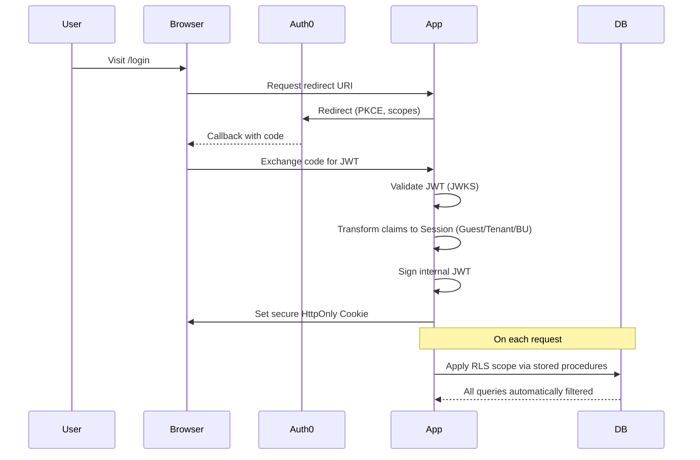
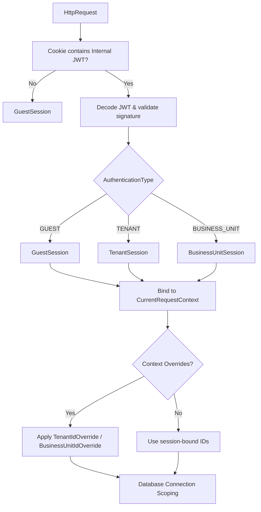

# 🔐 BlueGrid Security Framework

A modular, multi-tenant security stack with Auth0 SSO, sophisticated session typing, PostgreSQL row-level scoping, and comprehensive audit trails.

## 📋 Table of Contents

- [Quick Start](#quick-start)
- [Architecture Overview](#architecture-overview)
- [Auth0 SSO Integration](#auth0-sso-integration)
- [Session Type Enhancement](#session-type-enhancement)
- [Request Context Management](#request-context-management)
- [Database Scope Management](#database-scope-management)
- [Testing Framework](#testing-framework)
- [Configuration](#configuration)
- [Best Practices](#best-practices)
- [Security Considerations](#security-considerations)

---

## 🚀 Quick Start

### Core Flow: Auth0 SSO → Session Enrichment → DB Scoping



### Session Types Overview

| Type | Scope | Access Level | Used For |
|------|-------|-------------|----------|
| **`GuestSession`** | None | Anonymous | Public browsing, registration |
| **`TenantSession`** | Organization-wide | Admin/Platform | Tenant administration, cross-unit operations |
| **`BusinessUnitSession`** | Department/Unit | Operational | Store-level, departmental workflows |

---

## 🏗️ Architecture Overview

### Core Security Models

**Source:** [`security-core/model/`](./common/common-kotlin/security/security-core/src/main/kotlin/net/blugrid/security/core/model/)

**Mental Model:** Think of authentication types as **security clearance levels**:
- **GUEST** = Public visitor badge (no special access)
- **TENANT** = Company-wide executive badge (organization-level access)
- **BUSINESS_UNIT** = Department manager badge (unit-specific access)

Each session type inherits from a **base session contract** that guarantees:
- Unique session identifier for audit trails
- User identity for personalization
- Web application context for source tracking
- Session type classification for access control

### Context Resolution Strategy



---

## 🔑 Auth0 SSO Integration

### PKCE OAuth2/OIDC Flow

**Source:** [`server-rest/security/service/RedirectService.kt`](./common/common-kotlin/server/server-rest/src/main/kotlin/net/blugrid/server/rest/security/service/RedirectService.kt)

**Mental Model:** The `RedirectService` acts as a **secure travel agent** for authentication:

1. **Generates a cryptographic proof-of-origin** (PKCE code verifier/challenge)
2. **Builds Auth0 authorization URL** with:
    - Your app's identity (client ID)
    - What you want access to (audience, scopes)
    - Where to return after login (callback URL)
    - Security challenge for verification
3. **Redirects user to Auth0's secure login portal**

**Visual Flow:**
```
User Request → Generate PKCE Challenge → Build Auth0 URL → Redirect
     ↓
Auth0 Login → User Authenticates → Callback with Code → Token Exchange
```

### JWT Authentication Processing

**Source:** [`server-rest/security/filters/JwtAuthenticationFetcher.kt`](./common/common-kotlin/server/server-rest/src/main/kotlin/net/blugrid/server/rest/security/filters/JwtAuthenticationFetcher.kt)

**Mental Model:** The `JwtAuthenticationFetcher` is like a **digital ID card reader**:

1. **Extracts the ID card** (JWT) from the secure cookie wallet
2. **Validates the card's authenticity** using cryptographic signatures
3. **Reads the identity information** and determines access level
4. **Creates an authentication profile** for the current request
5. **Logs the authentication event** for security auditing

**Processing Pipeline:**
```
HTTP Request → Extract JWT Cookie → Validate Signature → Decode Session Type → Create Authentication → Audit Log
```

---

## 🎭 Session Type Enhancement

### Session Implementations

**Source:** [`security-core/session/`](./common/common-kotlin/security/security-core/src/main/kotlin/net/blugrid/security/core/session/)

**Mental Model:** Sessions are like **specialized access cards** with different privilege levels:

#### 1. **Guest Sessions** 🎫
Think of this as a **visitor pass** to a building:
- Contains: Session ID, User ID, App Context
- Access: Public areas only
- Duration: Usually temporary
- Use Case: Anonymous browsing, initial registration

#### 2. **Tenant Sessions** 🏢
Like an **executive access card** for the entire organization:
- Contains: All guest info + Tenant ID + Operator ID
- Access: Organization-wide resources
- Authority: Can act on behalf of the organization
- Use Case: Admin functions, cross-department operations

#### 3. **Business Unit Sessions** 🏪
Similar to a **department manager badge**:
- Contains: All tenant info + Business Unit ID
- Access: Specific department/unit resources
- Scope: Inherits tenant access but focused on unit
- Use Case: Store operations, departmental workflows

### Session Enhancement Process

**Source:** [`security-authentication/jwt/JwtAuthenticationDecoder.kt`](./common/common-kotlin/security/security-authentication/src/main/kotlin/net/blugrid/security/authentication/jwt/JwtAuthenticationDecoder.kt)

**Mental Model:** The decoder acts like a **smart card reader** that:

1. **Reads the JWT card** and extracts the encoded information
2. **Determines the card type** (Guest/Tenant/Business Unit)
3. **Creates the appropriate session object** based on the card type
4. **Handles any decoding errors** gracefully with fallback to guest access

**Enhancement Flow:**
```
Raw JWT → Parse JSON Claims → Identify Auth Type → Create Typed Session → Handle Errors
```

---

## 🎯 Request Context Management

### Current Request Context Interface

**Source:** [`security-core/context/CurrentRequestContext.kt`](./common/common-kotlin/security/security-core/src/main/kotlin/net/blugrid/security/core/context/CurrentRequestContext.kt)

**Mental Model:** `CurrentRequestContext` is like a **smart security checkpoint** that:

- **Automatically detects who you are** from your session
- **Knows which organization you belong to** (if any)
- **Understands your department/unit context** (if applicable)
- **Respects any temporary access overrides** from administrators
- **Provides a single source of truth** for all security decisions

**Context Resolution Logic:**
```
Request → Check Overrides → Extract from Session → Fallback to Defaults → Provide Context
```

### Context Override System

**Source:** [`security-core/context/RequestContextOverride.kt`](./common/common-kotlin/security/security-core/src/main/kotlin/net/blugrid/security/core/context/RequestContextOverride.kt)

**Mental Model:** Overrides work like **temporary administrative badges**:

| Override Type | Real-World Analogy | When Used | Duration |
|---------------|-------------------|-----------|----------|
| `TenantIdOverride` | **Master key for building** | Admin viewing any tenant's data | Single request |
| `BusinessUnitIdOverride` | **Department master key** | Cross-unit data operations | Single request |
| `IsUnscoped` | **Maintenance access pass** | System operations, backups | Single request |

**Override Lifecycle:**
```
Request Starts → Apply Override → Execute Operation → Automatically Clean Up → Request Ends
```

**Safety Features:**
- **Automatic cleanup** when operation completes
- **Thread-safe isolation** - doesn't affect other requests
- **Request-scoped only** - can't leak between requests
- **Explicit opt-in** - requires deliberate activation

---

## 🛢️ Database Scope Management

### Multi-Tenant Connection Provider

**Source:** [`server-multitenancy/config/IntegratedMultiTenantConnectionProvider.kt`](./common/common-kotlin/server/server-multitenancy/src/main/kotlin/net/blugrid/server/multitenancy/config/IntegratedMultiTenantConnectionProvider.kt)

```mermaid
flowchart LR
    A[New DB Connection] --> B{Current Session Type}
    B -- Unscoped --> C[configureUnscoped()]
    B -- TenantSession --> D[CALL set_tenant_session()]
    B -- BusinessUnitSession --> E[CALL set_business_unit_session()]

    C & D & E --> F[PostgreSQL session scoped]
    F --> G[All queries filtered via RLS policies]
```

**Mental Model:** The connection provider is like a **smart building access system**:

1. **When you request building access** (database connection):
    - Checks your current badge type (session)
    - Configures the building systems for your access level
    - Sets up automatic filtering for what you can see

2. **Access Levels:**
    - **Unscoped**: Master maintenance access (sees everything)
    - **Tenant**: Organization-level access (sees all company data)
    - **Business Unit**: Department access (sees unit data + inherited tenant data)

3. **Automatic Security:**
    - Every database query gets automatically filtered
    - No manual security checks needed in application code
    - Impossible to accidentally access wrong tenant's data

### PostgreSQL Stored Procedure Integration

**Mental Model:** The stored procedures are like **building security protocols**:

**Tenant Session Setup:**
```
Call: "Set building access for Organization A, using Session 123"
Effect: All elevators/doors now only show Organization A floors/rooms
```

**Business Unit Session Setup:**
```
Call: "Set access for Organization A, Department B, using Session 456"  
Effect: Access to Organization A resources + Department B specific areas
```

**Security Guarantees:**
- **Database enforces the rules** - application can't bypass them
- **Session tracking** - every action tied to specific session
- **Hierarchical access** - business units inherit tenant permissions
- **Fail-safe defaults** - unknown contexts get minimal access

### Audit Trail Integration

**Source:** [`data-persistence/audit/AuditEmbeddable.kt`](./common/common-kotlin/data/data-persistence/src/main/kotlin/net/blugrid/data/persistence/audit/AuditEmbeddable.kt)

**Mental Model:** Audit trails work like **automatic security cameras**:

**What Gets Recorded:**
- **When** something happened (created/modified timestamps)
- **Who** did it (session ID links to user identity)
- **What version** of the data it is (optimistic locking)

**Automatic Behavior:**
- **On Create**: Records session ID and timestamp automatically
- **On Update**: Updates last-changed session and timestamp
- **No Manual Work**: Happens transparently for all entities

**Benefits:**
- **Full accountability** - every change traceable to a session
- **Compliance ready** - automated audit trail generation
- **Investigation support** - can reconstruct who did what when

---

## 🧪 Testing Framework

### Test Context Setup

**Source:** [`platform-testing/security/TestApplicationContext.kt`](./common/common-kotlin/platform/platform-testing/src/main/kotlin/net/blugrid/platform/testing/security/TestApplicationContext.kt)

**Mental Model:** Test context setup is like **creating fake ID badges for testing**:

**Tenant Context Setup:**
```
"Create a fake executive badge for Tenant 1, Session 123, User 456"
→ Builds complete organization context
→ Sets up all authentication tokens
→ Ready for tenant-level operations testing
```

**Business Unit Context Setup:**
```
"Create a fake department manager badge for Tenant 1, Unit 5, Session 789"
→ All tenant setup PLUS business unit context
→ Ready for department-level operations testing
```

### Context Override Helpers

**Source:** [`platform-testing/support/TestContextHelpers.kt`](./common/common-kotlin/platform/platform-testing/src/main/kotlin/net/blugrid/platform/testing/support/TestContextHelpers.kt)

**Mental Model:** Context helpers are like **temporary test permissions**:

**Tenant Context Testing:**
```
doInTenantContext(tenantId: 1) {
    // Temporarily "become" Tenant 1 for this test
    // All database operations scoped to Tenant 1
    // Automatic cleanup when test completes
}
```

**Business Unit Context Testing:**
```
doInBusinessUnitContext(tenant: 1, unit: 5) {
    // Temporarily "become" Unit 5 of Tenant 1
    // Access to both tenant and unit data
    // Automatic cleanup
}
```

**Unscoped Testing:**
```
doInUnscopedContext {
    // Temporary "maintenance mode" access
    // Can see all data across all tenants
    // Use sparingly for admin operation tests
}
```

### Session Factories

**Source:** [`platform-testing/factory/session/`](./common/common-kotlin/platform/platform-testing/src/main/kotlin/net/blugrid/platform/testing/factory/session/)

**Mental Model:** Session factories are like **ID badge printing machines** with presets:

**Factory Capabilities:**
- **Default badges** for common scenarios
- **Random badges** for chaos/fuzz testing
- **Scenario-specific badges** for business workflows
- **Builder pattern** for complex custom badges

**Example Scenarios:**
- `headquartersSession()` → Executive-level access for HQ operations
- `storeEmployeeSession(42)` → Store #42 employee badge with POS access
- `regionalManagerSession("WEST")` → Regional manager for Western region

**Builder Pattern Benefits:**
- **Fluent API** for readable test setup
- **Sensible defaults** reduce boilerplate
- **Flexibility** for edge case testing
- **Consistency** across test suites

---

## 🔧 Configuration

### Security Properties

**Source:** [`security-core/config/SecurityProps.kt`](./common/common-kotlin/security/security-core/src/main/kotlin/net/blugrid/security/core/config/SecurityProps.kt)

**Mental Model:** Security configuration is like **setting up building security systems**:

**Auth0 Configuration:**
- **Building Address** (auth0Domain) - Where to send people to authenticate
- **Tenant ID** (audience) - Which organization this app represents
- **Access Card Type** (clientId) - Your app's identity with Auth0

**Cookie Configuration:**
- **Badge Storage** (jwt) - Where to keep the authentication token
- **Security Protocols** (PKCE, state, nonce) - Additional security measures
- **Badge Expiration** (maxAge) - How long badges remain valid

### Redirect Configuration

**Source:** [`security-core/config/RedirectProps.kt`](./common/common-kotlin/security/security-core/src/main/kotlin/net/blugrid/security/core/config/RedirectProps.kt)

**Mental Model:** Redirect configuration is like **setting up building entry/exit procedures**:

- **Main Entrance** (loginCallbackUrl) - Where Auth0 sends people back
- **Success Reception** (loginSuccessUrl) - Where to go after successful login
- **Security Office** (loginFailureUrl) - Where to go if login fails
- **Exit Processing** (logoutCallbackUrl) - Where to go when leaving
- **Guest Registration** (registrationUrl) - Where new users sign up

### JWT Token Structure

**Source:** [`security-tokens/model/JwtToken.kt`](./common/common-kotlin/security/security-tokens/src/main/kotlin/net/blugrid/security/tokens/model/JwtToken.kt)

**Mental Model:** JWT tokens are like **smart ID badges** containing:

**Core Identity:**
- **Authentication Level** - What type of access (Guest/Tenant/Business Unit)
- **Personal Info** - User details for personalization
- **Organization Context** - Which company/tenant (if applicable)
- **Session Details** - Current login session information

**Security Features:**
- **Expiration Time** - When the badge becomes invalid
- **Role List** - Specific permissions granted
- **Custom Attributes** - Additional context information
- **Scope Identifiers** - Tenant and business unit IDs

---

## ✅ Best Practices

### 1. Context Management
- **Always use `CurrentRequestContext`** - It's your single source of security truth
- **Think of overrides as powerful tools** - Use sparingly, like administrator privileges
- **Clean up is automatic** - But be mindful in background jobs where threads persist
- **Validate before sensitive operations** - Double-check context when dealing with critical data

### 2. Database Operations
- **Trust the automatic scoping** - The connection provider handles security for you
- **Use `runUnscoped` like sudo** - Only for legitimate administrative operations
- **Be aware of performance impact** - Each connection setup calls PostgreSQL functions
- **Design for multi-tenancy from the start** - Don't bolt it on later

### 3. Testing
- **Use factories for realistic data** - They create properly structured test scenarios
- **Test both success and failure paths** - Security is about what you can't do too
- **Test context switching** - Verify overrides work and clean up properly
- **Mock external dependencies** - Auth0 calls, database procedures, etc.

### 4. Performance Considerations
- **Connection scoping has overhead** - ~1-2ms per connection for PostgreSQL function calls
- **Cache context information** - Don't repeatedly fetch the same tenant data
- **Monitor RLS policy performance** - Complex policies can slow queries
- **Size connection pools appropriately** - Balance connection reuse with memory usage

---

## 🔒 Security Considerations

### 1. Token Security
**Mental Model:** Tokens are like **high-security access cards**:
- **Signature validation** ensures cards weren't forged
- **Expiration enforcement** prevents use of old/stolen cards
- **Secure storage** keeps cards safe from theft (HttpOnly cookies)
- **Rotation capability** allows replacement of compromised cards

### 2. Database Security
**Mental Model:** Database security is like **building-wide access control**:
- **Row-level security** acts like smart locks on every door/drawer
- **Automatic filtering** means you can't accidentally see restricted areas
- **Audit trails** work like security cameras recording all access
- **Connection scoping** is like having your access card configure the building for you

### 3. Context Isolation
**Mental Model:** Each request is like a **separate, isolated security session**:
- **No shared state** - Your session doesn't affect other people's sessions
- **Automatic cleanup** - Security context resets after each request
- **Thread safety** - Multiple people can use the system simultaneously
- **Administrative segregation** - Admin operations are clearly marked and logged

### 4. Multi-Tenancy Guarantees
**Mental Model:** Multi-tenancy is like **having separate, secure office buildings**:
- **Database enforcement** - Even application bugs can't access wrong tenant data
- **Hierarchical access** - Department access inherits company access
- **Session tracking** - Every action tied to a specific person and session
- **Fail-safe defaults** - Unknown situations default to maximum security

---

## 📚 Related Modules

| Module | Purpose | Key Components |
|--------|---------|----------------|
| [`security-core`](./common/common-kotlin/security/security-core/) | Core security abstractions | Context management, session types |
| [`security-authentication`](./common/common-kotlin/security/security-authentication/) | Authentication implementations | JWT processing, session mapping |
| [`security-tokens`](./common/common-kotlin/security/security-tokens/) | Token generation and validation | JWT factory, decoders |
| [`server-multitenancy`](./common/common-kotlin/server/server-multitenancy/) | Multi-tenant infrastructure | Connection provider, tenant resolution |
| [`server-rest`](./common/common-kotlin/server/server-rest/) | REST API security integration | Authentication filters, cookie management |
| [`data-persistence`](./common/common-kotlin/data/data-persistence/) | Database integration | Audit embeddables, scoped entities |
| [`platform-testing`](./common/common-kotlin/platform/platform-testing/) | Testing utilities | Session factories, context helpers |

This security framework provides a robust, enterprise-grade approach to authentication and authorization, seamlessly combining modern OAuth2/OIDC flows with sophisticated database-level security controls and comprehensive audit capabilities.
